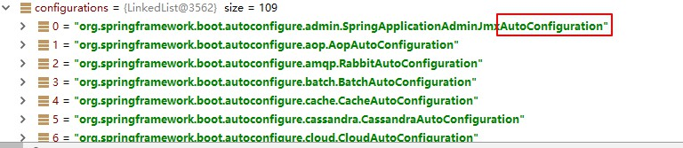
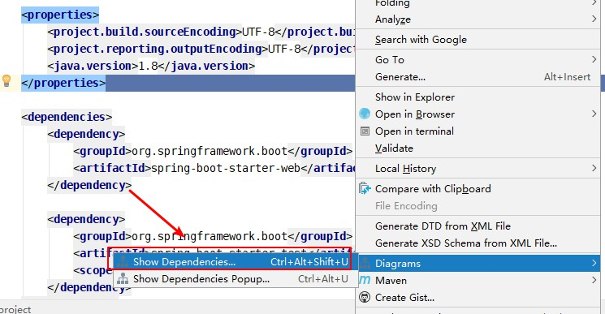

Spring Boot是由Pivota團隊提供的全新框架，其設計目的是用來簡化新Spring應用的初始建置以及開發過程。  
該框架使用了特定的方式來進行配置，從而使開發人員不再需要定義樣板化的配置。

## 2、微服務

微服務：架構風格（Micro service）

一個應用是一組小型服務，可通過HTTＰ的方式進行互通

單應用：ALL IN ONE

微服務：每個功能元素最終都可以獨立替換和升級軟件單元

## 3、準備環境

環境

- JDK1.8
- maven 3.x :maven3.3以上
- IDEA2017
- SpringBoot 2.1.2RELEASE

### 1、MAVEN设置

```xml
<!-- 配置JDK版本 -->
<profile>    
    <id>jdk18</id>    
    <activation>    
        <activeByDefault>true</activeByDefault>    
        <jdk>1.8</jdk>    
    </activation>    
    <properties>    
        <maven.compiler.source>1.8</maven.compiler.source>    
        <maven.compiler.target>1.8</maven.compiler.target>    
        <maven.compiler.compilerVersion>1.8</maven.compiler.compilerVersion>    
    </properties>     
</profile>
   <!-- 當nexus-aliyun下載不了的package，或許這個鏡像能下載，
        才開放它，因為這比較慢，而且要把它放在首位，即 nexus-aliyun 之前，做過測試。
        所以它的用途只有那麼一瞬間，可以透過url確認一下
    -->
    <!-- <mirror>
        <id>spring-libs-milestone</id>
        <mirrorOf>central</mirrorOf>
        <name>Spring Milestones</name>
        <url>http://repo.spring.io/libs-milestone</url>
    </mirror> -->

    <!-- nexus-aliyun 首選，放第一位,有不能下載的package，再去做其他鏡像的選擇  -->
    <mirror>
        <id>nexus-aliyun</id>
        <mirrorOf>central</mirrorOf>
        <name>Nexus aliyun</name>
        <url>http://maven.aliyun.com/nexus/content/groups/public</url>
    </mirror>

    <!-- 備選鏡像，也是可以通過 url 確認，
        該鏡像是否含有你想要的package，它比 spring-libs-milestone 快  -->
    <mirror>
        <id>central-repository</id>
        <mirrorOf>*</mirrorOf>
        typor<name>Central Repository</name>
        <url>http://central.maven.org/maven2/</url>
    </mirror>  
```

## 4、Spring Boot的Hello World

### 1、創建一個Ｍaven工程

### 2、導入Spring Boot的相關依賴

```xml
<parent>
    <groupId>org.springframework.boot</groupId>
    <artifactId>spring-boot-starter-parent</artifactId>
    <version>2.0.1.RELEASE</version>
    <relativePath/> <!-- lookup parent from repository -->
</parent>

<properties>
    <project.build.sourceEncoding>UTF-8</project.build.sourceEncoding>
    <project.reporting.outputEncoding>UTF-8</project.reporting.outputEncoding>
    <java.version>1.8</java.version>
</properties>

<dependencies>
    <dependency>
        <groupId>org.springframework.boot</groupId>
        <artifactId>spring-boot-starter-web</artifactId>
    </dependency>

    <dependency>
        <groupId>org.springframework.boot</groupId>
        <artifactId>spring-boot-starter-test</artifactId>
        <scope>test</scope>
    </dependency>
</dependencies>

```

### 3、編寫主程式

```java
@SpringBootApplication
public class SpringBoot01HelloQuickApplication {

    public static void main(String[] args) {
        SpringApplication.run(SpringBoot01HelloQuickApplication.class, args);
    }
}
```

### 4、編寫相應的Controller和Service

```java
@Controller
public class HelloController {

    @ResponseBody
    @RequestMapping("/hello")
    public  String  hello(){
        return "hello world";
    }
}
```

### 5、運行主程式測試

訪問 localhost:8080/hello

### 6、簡化部署

在pom.xml文件中，導入build插件

```xml
<build>
    <plugins>
        <plugin>
            <groupId>org.springframework.boot</groupId>
            <artifactId>spring-boot-maven-plugin</artifactId>
        </plugin>
    </plugins>
</build>
```

## 5、HelloWorld深度理解

### 1.POM.xml文件

#### 1、父項目

```xml
<parent>
    <groupId>org.springframework.boot</groupId>
    <artifactId>spring-boot-starter-parent</artifactId>
    <version>2.0.1.RELEASE</version>
    <relativePath/> <!-- lookup parent from repository -->
</parent>
```

這個父項目**spring-boot-starter-parent**又依賴一個父項目

```xml
<parent>
    <groupId>org.springframework.boot</groupId>
    <artifactId>spring-boot-dependencies</artifactId>
    <version>2.0.1.RELEASE</version>
    <relativePath>../../spring-boot-dependencies</relativePath>
</parent>
```

下面有個屬性，定義了對應的版本號

```xml
<properties>
    <activemq.version>5.15.3</activemq.version>
    <antlr2.version>2.7.7</antlr2.version>
    <appengine-sdk.version>1.9.63</appengine-sdk.version>
    <artemis.version>2.4.0</artemis.version>
    <aspectj.version>1.8.13</aspectj.version>
    <assertj.version>3.9.1</assertj.version>
    <atomikos.version>4.0.6</atomikos.version>
    <bitronix.version>2.1.4</bitronix.version>
    <build-helper-maven-plugin.version>3.0.0</build-helper-maven-plugin.version>
    。。。。。。。
```

Spring Boot的版本仲裁中心 会自动导入对应的版本，不需要我们自己导入依赖，没有dependencies里面管理的依赖自己声明

#### 2、启动器

```xml
<dependency>
    <groupId>org.springframework.boot</groupId>
    <artifactId>spring-boot-starter-web</artifactId>
</dependency>
```

**spring-boot-starter-web:**幫我們導入web模塊正常運行所依賴的組件

**spring boot**將所有的功能場景都抽取，做成一個個的starter啟動器)，只需要在項目裡引入這些starter相關場景的所有依賴都會被導入進來，要用什麼功能就導入該場景的啟動器。

### 2、主程式入口

```java
@SpringBootApplication
public class SpringBoot01HelloQuickApplication {

    public static void main(String[] args) {
        SpringApplication.run(SpringBoot01HelloQuickApplication.class, args);
    }
}
```

**@SpringBootApplication:** 說明這個class是SpringBoot的主配置類，SpringBoot就應該運行這個class的main方法來啟動運行

進入SpringBootApplication註解

```java
@Target({ElementType.TYPE})
@Retention(RetentionPolicy.RUNTIME)
@Documented
@Inherited
@SpringBootConfiguration
@EnableAutoConfiguration
@ComponentScan(
    excludeFilters = {@Filter(
    type = FilterType.CUSTOM,
    classes = {TypeExcludeFilter.class}
), @Filter(
    type = FilterType.CUSTOM,
    classes = {AutoConfigurationExcludeFilter.class}
)}
)
public @interface SpringBootApplication {
```

**@SpringBootConfiguration**：SpringBoot的配置類：標準在某個class上，表示這是一個SpringBoot的配置類

**@Configuration**:配置類上，來標注這個註解；
配置類 ---- 配置文件，也是容器中的一个組件（@Component）
**@EnableAutoConfiguration**:開啟自動配置功能
以前需要自動配置的東西，Spring Boot幫我們自動配置；@EnableAutoConfiguration告訴SpringBoot開啟自動
配置功能；這樣自動配置才生效。 

```java
@AutoConfigurationPackage
@Import({AutoConfigurationImportSelector.class})
public @interface EnableAutoConfiguration { 
```

**@AutoConfigurationPackage**:自動配置包
**@Import({Registrar.class})**：底層註解，給容器導入組件；
將主配置類（@SpringBootApplication標示的類）的所在package及下面所有的子package裡面的所有組件掃描到Spring容器； 

**@Import({AutoConfigurationImportSelector.class})：**
給容器導入組件 

AutoConfigurationImportSelector：導入組建選擇器

將所有需要導入的組件以全類名的方式返回；這些組件將以字符串數組String[] 添加到容器中；

會給容器非常多的自動配置類，（xxxAutoConfiguration）;就是給容器中導入這個場景需要的所有組件，並配置好這些做件。




```java
protected List<String> getCandidateConfigurations(AnnotationMetadata metadata,
AnnotationAttributes attributes) {
	List<String> configurations =
SpringFactoriesLoader.loadFactoryNames(this.getSpringFactoriesLoaderFactoryClass(),
this.getBeanClassLoader());
	Assert.notEmpty(configurations, "No auto configuration classes found in META‐INF/spring.factories. If you are using a custom packaging, make sure that file is correct.");
	return configurations;
} 
```

`SpringFactoriesLoader.loadFactoryNames(this.getSpringFactoriesLoaderFactoryClass(),`
`this.getBeanClassLoader());` 

Spring Boot在啟動的時候從類路徑下的META-INF/spring.factorys中獲取的EnableAutoConfiguration指定的值；

將這些值作為自動配置類導入到容器中，自動配置就生效了。 


J2EE的整體解決方案

org\springframework\boot\spring-boot-autoconfigure\2.0.1.RELEASE\spring-boot-autoconfigure-2.0.1.RELEASE.jar 

## 6、使用Spring Initializer創建快速響導 

1.IDE支持使用Spring Initializer

自己選擇需要的組件:例如web

默認生成的SpringBoot項目

- 主程式已经建置好了，我們只需要完成我們的邏輯

- resources文件夾目錄結構

  - static:保存所有的靜態文件；js css images

  - templates:保存所有的模板頁面；（Spring Boot默認從jar包使用嵌入式的Tomcat,默認不支持JSP）；可

    以使用模板引擎（freemarker.thymeleaf）;

  - application.properties:Spring Boot的默認配置，例如 server.port=9000 

# 二、配置文件 

## 1、配置文件 

Spring Boot使用全局配置文件，配置文件名是固定的；

- application.properties
- application.yml 

配置文件用：修改Spring Boot在底层封装好的默認值；

YAML（YAML AIN'T Markup Language）

是一个標記語言

又不是一个標記語言

**標記語言：**

以前的配置文件；大多數使用的是 xxx.xml文件；

以數據為中心，比json、xml等更適合做配置文件

YAML：配置範例

```yaml
server:
	port: 9000 
```

XML: 

```xml
<server>
	<port>9000</port>
</server> 
```

## 2、YAML語法 

### 1、基本語法

k:(空格)v:表示一堆鍵值對（空格必须有）；

以空格的縮進来控制層級關係；只要是左對齊的一列數據，都是同一層級的

```yaml
server:
	port: 9000
	path: /hello 

```

屬性和值也是大小寫區分

### 2、值的寫法

**字面量：普通的值（數字，字符串，布林）** 

k: v:字面直接来寫；

字符串默認不用加上單引號或者双引號

"":**双引號** 不會轉譯字符串裡的特殊字符；特殊字符會作為想要表示的意思

`name:"zhangsan\n lisi"` 輸出：`zhangsan換行 lisi`

'':**單引號** 會轉譯特殊字符，特殊字符最终只是一個普通的字符串數據

`name:'zhangsan\n lisi'` 輸出：`zhangsan\n lisi` 

**對象、Map（屬性和值）鍵值對** 

k :v ：在下一行來寫對象的屬性和值的關係；注意空格控制縮進

對象還是k:v的方式 

```yaml
frends:
	lastName: zhangsan
	age: 20 
```

行內寫法 

```yaml
friends: {lastName: zhangsan,age: 18} 
```

**數組（List、Set）:**
用-表示數組中的一个元素 

```yaml
pets:
 ‐ cat
 ‐ dog
 ‐ pig 
```

行內寫法 

```yaml
pets: [cat,dog,pig] 
```

**組合變量**

多個組合到一起

## 3、配置文件值注入 

### 1、@ConfigurationProperties

1、application.yml 配置文件 

```yaml
person:
  age: 18
  boss: false
  birth: 2017/12/12
  maps: {k1: v1,k2: 12}
  lists:
   - lisi
   - zhaoliu
  dog:
    name: wangwang
    age: 2
  last-name: wanghuahua
```

`application.properties` 配置文件（二選一） 

```properties
idea配置文件utf-8
properties 默認GBK
person.age=12
person.boss=false
person.last-name=張三
person.maps.k1=v1
person.maps.k2=v2
person.lists=a,b,c
person.dog.name=wanghuahu
person.dog.age=15
```

所以中文輸出亂碼，更改settings-->file encoding -->[property-->utf-8 ,勾選轉成ascii] 

javaBean 

```java
/**
* 將配置文件的配置每個屬性的值，映射到组件中
* @ConfigurationProperties:告诉SpringBoot將文本的所有屬性和配置文件中的相關配置進行绑定；
* prefix = "person" 配置文件person的那个屬性進行一一映射
* *
只有這個組件是容器中的组件，才能提供到容器中
*/
@Component
@ConfigurationProperties(prefix = "person")
public class Person {
    private String lastName;
    private Integer age;
    private Boolean boss;
    private Map<String,Object> maps;
    private List<Object> lists;
    private Dog dog;
```

導入配置文件處理器，以後編寫配置就有提示了

```xml
<dependency>
	<groupId>org.springframework.boot</groupId>
	<artifactId>spring‐boot‐configuration‐processor</artifactId>
	<optional>true</optional>
</dependency> 
```

### 2、@Value註解

更改javaBean中的註解

```java
@Component
public class Person {
    /**
     * <bean class="Person">
     *     <property name="lastName" value="字面量/${key}從環境變量/#{spEL}"></property>
     * </bean>
     */
    @Value("${person.last-name}")
    private String lastName;
    @Value("#{11*2}")
    private Integer age;
    @Value("true")
    private Boolean boss;
```

|                | @ConfigurationProperties |  @Value  |
| :------------: | :----------------------: | :------: |
|      功能      |   批量注入配置文件屬性   | 單個指定 |
| 鬆散綁定(語法) |           支持           |  不支持  |
|      spEL      |          不支持          |   支持   |
|   JSR303校驗   |           支持           |  不支持  |
|    複雜類型    |           支持           |  不支持  |

> 鬆散語法：javaBean中last-name(或者lastName) -->application.properties中的last-name;
>
> spEL語法：#{11*2} 
>
> JSR303：@Value會直接忽略，校驗規則

JSR303校驗：

```java
@Component
@ConfigurationProperties(prefix = "person")
@Validated
public class Person {
    @Email
    private String lastName;
```

複雜類型範例：

```java
@Component
public class Person {
    /**
     * <bean class="Person">
     *     <property name="lastName" value="字面量/${key}从环境变量/#{spEL}"></property>
     * </bean>
     */
    private String lastName;
    private Integer age;
    private Boolean boss;
   // @Value("${person.maps}")
    private Map<String,Object> maps;
```

以上會報錯，不支持複雜類型

**使用場景分析**

​	如果說，我们只是在某個業務邏輯中獲取一下配置文件的某一項值，使用@Value；

如果專門編寫了一個javaBean和配置文件進行映射，我們直接使用@ConfigurationProperties

範例：

1、編寫新的Controller文件

```java
@RestController
public class HelloController {

    @Value("${person.last-name}")
    private String name;
    @RequestMapping("/hello")
    public  String sayHello(){
        return "Hello"+ name;
    }
}
```

2、配置文件

```properties
person.age=12
person.boss=false
person.last-name=李四
person.maps.k1=v1
person.maps.k2=v2
person.lists=a,b,c
person.dog.name=wanghuahu
person.dog.age=15
```

3、測試運行

訪問 localhost:9000/hello

结果为`Hello 李四`

### 3、其他註解

 **@PropertySource**

作用：加載指定的properties配置文件

1、新建一個person.properties文件

```properties
person.age=12
person.boss=false
person.last-name=李四
person.maps.k1=v1
person.maps.k2=v2
person.lists=a,b,c
person.dog.name=wanghuahu
person.dog.age=15
```

2、在javaBean中加入@PropertySource註解

```java
@PropertySource(value = {"classpath:person.properties"})
@Component
@ConfigurationProperties(prefix = "person")
public class Person {
    private String lastName;
```

**@ImportResource**

作用：導入Spring配置文件，並且讓這個配置文件生效

1、新建一個Spring的配置文件，bean.xml

```xml
<?xml version="1.0" encoding="UTF-8"?>
<beans xmlns="http://www.springframework.org/schema/beans"
       xmlns:xsi="http://www.w3.org/2001/XMLSchema-instance"
       xsi:schemaLocation="http://www.springframework.org/schema/beans http://www.springframework.org/schema/beans/spring-beans.xsd">

    <bean id="HelloService" class="com.wdjr.springboot.service.HelloService"></bean>
</beans>
```

2、編寫測試類，檢查容器是否加載Spring配置文件寫的bean

```java
@Autowired
ApplicationContext ioc;

@Test
public void testHelloService(){
    boolean b = ioc.containsBean("HelloService");
    System.out.println(b);
}
```

> import org.springframework.context.ApplicationContext;

3、運行檢測

結果為false，没有加載配置的内容

4、使用@ImportResource註解

將@ImportResource標註在主配置類上

```java
@ImportResource(locations={"classpath:beans.xml"})
@SpringBootApplication
public class SpringBoot02ConfigApplication {

    public static void main(String[] args) {
        SpringApplication.run(SpringBoot02ConfigApplication.class, args);
    }
}
```

5、再次運行檢測

結果為true

缺點：每次指定xml文件太麻烦

SpringBoot推薦給容器添加組件的方式：

1、配置類=====Spring的xml配置文件（old）

2、全註解方式@Configuration+@Bean（new）


```java
/**
 * @Configuration：指當前類是一個配置類；就是来代替之前的Spring配置文件
 *
 * 在配置文件中用<bean></bean>標籤添加組件
 */

@Configuration
public class MyAppConfig {

    //將方法的返回值添加到容器中；容器這個組件id就是方法名
    @Bean
    public HelloService helloService01(){
        System.out.println("配置類给容器添加了HelloService组件");
        return new HelloService();
    }
}
```

```java
@Autowired
ApplicationContext ioc;

@Test
public void testHelloService(){
    boolean b = ioc.containsBean("helloService01");
    System.out.println(b);
}
```

 *容器這個組件id就是方法名* 

## 4、配置文件占位符

#### 1、隨機數

```properties
${random.value} 、${random.int}、${random.long}
${random.int(10)}、${random.int[100,200]}
```

#### 2、獲取配置值

```properties
person.age=${random.int}
person.boss=false
person.last-name=张三${random.uuid}
person.maps.k1=v1
person.maps.k2=v2
person.lists=a,b,c
person.dog.name=${person.last-name}'s wanghuahu
person.dog.age=15
```

存在以下兩種情况

沒有聲明person.last-name`会报错，新聲明的需要加默認值

```properties
person.age=${random.int}
person.boss=false
person.last-name=张三${random.uuid}
person.maps.k1=v1
person.maps.k2=v2
person.lists=a,b,c
person.dog.name=${person.hello:hello}'s wanghuahu
person.dog.age=15
```

结果：输出`hello's wanghuahua`

## 5、Profile

### 1、多Profile文件

我们在主配置文件編寫的时候，文件名可以是 application-{profile}.properties/yml

- application.properties
- application-dev.properties
- application-prod.properties

默認使用application.properties

application.properties配置文件指定

```properties
spring.profiles.active=dev
```

### 2、YAML文件

```yaml
server:
  port: 8081
spring:
  profiles:
    active: dev

---

server:
  port: 9000
spring:
  profiles: dev

---
server:
  port: 80
spring:
  profiles: prod

```

### 3、激活指定profile

1、在配置文件中激活

2、命令行：

--spring.profiles.active=dev


優先級大於配置文件

打包 成jar後

`java -jar spring-boot-02-config-0.0.1-SNAPSHOT.jar --spring.profiles.active=dev`

虛擬機參數

`-Dspring.profiles.active=dev`

## 6、加載配置文件位置

SpringBoot啟動掃描以下位置的application.properties或者application.yml文件作为Spring boot的默認配置文件

- file:./config/
- file./
- classpath:/config/
- classpath:/

優先級從高到低順序，高優先級會覆蓋低優先级的相同配置；互補配置

也可以通過spring.config.location来改變默認配置

> ```
> server.servlet.context-path=/boot03
> ```

註：spring boot1x 是server.context.path=/boot02


還可以通過spring.config.location来改變配置文件的位置

項目打包好了以後，可以使用命令行參數的形式，啟動項目的時候来指定配置文件的新位置；指定配置文件和默認的配置文件會共同起作用，互補配置

`java -jar spring-boot-config-02-0.0.1-SNAPSHOT.jar --spring.config.location=E:/work/application.properties`

維運比較有用，從外部加載，不用修改別的文件

## 7.引入外部配置

**SpringBoot也可以從以下位置加載配置；優先級從高到低；高優先級覆蓋低優先級，可以互補**

1. 命令行參數

   java -jar spring-boot-config-02-0.0.1-SNAPSHOT.jar --server.port=9005 --server.context-path=/abc

   中間一個空格

2. 来自java:comp/env的JNDI屬性

3. java系統屬性（System.getProperties()）

4. 操作系统環境變量

5. RandomValuePropertySource配置的random.*數中值

   

   **優先級加載profile,    由jar包外到jar包内**

6. **jar包外部的application-{profile}.properties或application.yml(带Spring.profile)配置文件**

7. **jar包内部的application-{profile}.properties或application.yml(带Spring.profile)配置文件**

8. **jar包外部的application.properties或application.yml(带Spring.profile)配置文件**

9. **jar包内部的application.properties或application.yml(不带spring.profile)配置文件**

   

10. @Configuration註解類的@PropertySource

11. 通過SpringApplication.setDefaultProperties指定的默認屬性

[官方文件](https://docs.spring.io/spring-boot/docs/2.0.1.RELEASE/reference/htmlsingle/#boot-features-external-config)

## 8、自动配置

[Spring的所有配置參數](https://docs.spring.io/spring-boot/docs/2.0.1.RELEASE/reference/htmlsingle/#common-application-properties)

自動配置原理很關鍵

### 1、自動配置原理

1）、SpringBoot啟動的時候加載主配置類，開啟自動配置功能，@EnableAutoConfiguration

2）、@EnableAutoConfiguration 作用：

- 利用AutoConfigurationImportSelector給容器中導入一些组件
- 可以查看selectImports()方法的内容
- 獲取候選的配置

```java
List<String> configurations = this.getCandidateConfigurations(annotationMetadata, attributes);
```


- 掃描類路徑下的
```java
  SpringFactoriesLoader.loadFactoryNames(）
  掃描所有jar包類路徑下的 MATA-INF/spring.factories
  把掃描到的這些文件的内容包装成properties對象
  從properties中獲取到EnableAutoConfiguration.class類（類名）對應的值，然後把他們添加到容器中
```
將類路徑下 MATE-INF/spring.factories裡面配置的所有的EnableAutoConfiguration的值加入到了容器中；

3）、每一個自動配置類進行自動配置功能；

4）、以**HttpEncodingAutoConfiguration** 範例

```java
@Configuration //表示是一個配置類，以前編寫的配置文件一樣，也可以给容器中添加组件
@EnableConfigurationProperties({HttpEncodingProperties.class})//啟動指定類的Configurationproperties功能；将配置文件中的值和HttpEncodingProperties绑定起来了；並把HttpEncodingProperties加入ioc容器中
@ConditionalOnWebApplication//根據不同的條件，進行判断，如果滿足条件，整個配置類里面的配置就會失效，判斷是否為web應用；
(
    type = Type.SERVLET
)
@ConditionalOnClass({CharacterEncodingFilter.class})//判斷當前項目有没有這個類，解決亂碼的過濾器
@ConditionalOnProperty(
    prefix = "spring.http.encoding",
    value = {"enabled"},
    matchIfMissing = true
)//判斷配置文件是否存在某個配置 spring.http.encoding，matchIfMissing = true如果不存在也是成立，即使不配置也生效
public class HttpEncodingAutoConfiguration {
   //給容器添加组件，這個组件的值需要從properties屬性中獲取
    private final HttpEncodingProperties properties;
	//只有一個有參數構造器的晴況下，參數的值就會從容器中拿
    public HttpEncodingAutoConfiguration(HttpEncodingProperties properties) {
        this.properties = properties;
    }

    @Bean
    @ConditionalOnMissingBean
    public CharacterEncodingFilter characterEncodingFilter() {
        CharacterEncodingFilter filter = new OrderedCharacterEncodingFilter();
        filter.setEncoding(this.properties.getCharset().name());
        filter.setForceRequestEncoding(this.properties.shouldForce(org.springframework.boot.autoconfigure.http.HttpEncodingProperties.Type.REQUEST));
        filter.setForceResponseEncoding(this.properties.shouldForce(org.springframework.boot.autoconfigure.http.HttpEncodingProperties.Type.RESPONSE));
        return filter;
    }

```

5）、所有在配置文件中能配置的屬性都是在xxxProperties類中封装着；配置文件能配置什麼就可以参照某个功能對應的這個屬性類

```java
@ConfigurationProperties(prefix = "spring.http.encoding")//从配置文件中的值進行绑定和bean屬性進行绑定
public class HttpEncodingProperties {
```

根據當前不同條件判斷，決定這個配置類是否生效？

一旦這個配置類生效；這個配置類會給容器中添加各組件；這些組件的屬性是從對應的properties中獲取的，這些類裡面的每個屬性又是和配置文件绑定的


### 2、所有的自動配置组件

每一個xxxAutoConfiguration這樣的類都是容器中的一個组件，都加入到容器中；

作用：用他們做自動配置

```properties
# Auto Configure
org.springframework.boot.autoconfigure.EnableAutoConfiguration=\
org.springframework.boot.autoconfigure.admin.SpringApplicationAdminJmxAutoConfiguration,\
org.springframework.boot.autoconfigure.aop.AopAutoConfiguration,\
org.springframework.boot.autoconfigure.amqp.RabbitAutoConfiguration,\
org.springframework.boot.autoconfigure.batch.BatchAutoConfiguration,\
org.springframework.boot.autoconfigure.cache.CacheAutoConfiguration,\
org.springframework.boot.autoconfigure.cassandra.CassandraAutoConfiguration,\
org.springframework.boot.autoconfigure.cloud.CloudAutoConfiguration,\
org.springframework.boot.autoconfigure.context.ConfigurationPropertiesAutoConfiguration,\
org.springframework.boot.autoconfigure.context.MessageSourceAutoConfiguration,\
org.springframework.boot.autoconfigure.context.PropertyPlaceholderAutoConfiguration,\
org.springframework.boot.autoconfigure.couchbase.CouchbaseAutoConfiguration,\
org.springframework.boot.autoconfigure.dao.PersistenceExceptionTranslationAutoConfiguration,\
org.springframework.boot.autoconfigure.data.cassandra.CassandraDataAutoConfiguration,\
org.springframework.boot.autoconfigure.data.cassandra.CassandraReactiveDataAutoConfiguration,\
org.springframework.boot.autoconfigure.data.cassandra.CassandraReactiveRepositoriesAutoConfiguration,\
org.springframework.boot.autoconfigure.data.cassandra.CassandraRepositoriesAutoConfiguration,\
org.springframework.boot.autoconfigure.data.couchbase.CouchbaseDataAutoConfiguration,\
org.springframework.boot.autoconfigure.data.couchbase.CouchbaseReactiveDataAutoConfiguration,\
org.springframework.boot.autoconfigure.data.couchbase.CouchbaseReactiveRepositoriesAutoConfiguration,\
org.springframework.boot.autoconfigure.data.couchbase.CouchbaseRepositoriesAutoConfiguration,\
org.springframework.boot.autoconfigure.data.elasticsearch.ElasticsearchAutoConfiguration,\
org.springframework.boot.autoconfigure.data.elasticsearch.ElasticsearchDataAutoConfiguration,\
org.springframework.boot.autoconfigure.data.elasticsearch.ElasticsearchRepositoriesAutoConfiguration,\
org.springframework.boot.autoconfigure.data.jpa.JpaRepositoriesAutoConfiguration,\
org.springframework.boot.autoconfigure.data.ldap.LdapDataAutoConfiguration,\
org.springframework.boot.autoconfigure.data.ldap.LdapRepositoriesAutoConfiguration,\
org.springframework.boot.autoconfigure.data.mongo.MongoDataAutoConfiguration,\
org.springframework.boot.autoconfigure.data.mongo.MongoReactiveDataAutoConfiguration,\
org.springframework.boot.autoconfigure.data.mongo.MongoReactiveRepositoriesAutoConfiguration,\
org.springframework.boot.autoconfigure.data.mongo.MongoRepositoriesAutoConfiguration,\
org.springframework.boot.autoconfigure.data.neo4j.Neo4jDataAutoConfiguration,\
org.springframework.boot.autoconfigure.data.neo4j.Neo4jRepositoriesAutoConfiguration,\
org.springframework.boot.autoconfigure.data.solr.SolrRepositoriesAutoConfiguration,\
org.springframework.boot.autoconfigure.data.redis.RedisAutoConfiguration,\
org.springframework.boot.autoconfigure.data.redis.RedisReactiveAutoConfiguration,\
org.springframework.boot.autoconfigure.data.redis.RedisRepositoriesAutoConfiguration,\
org.springframework.boot.autoconfigure.data.rest.RepositoryRestMvcAutoConfiguration,\
org.springframework.boot.autoconfigure.data.web.SpringDataWebAutoConfiguration,\
org.springframework.boot.autoconfigure.elasticsearch.jest.JestAutoConfiguration,\
org.springframework.boot.autoconfigure.flyway.FlywayAutoConfiguration,\
org.springframework.boot.autoconfigure.freemarker.FreeMarkerAutoConfiguration,\
org.springframework.boot.autoconfigure.gson.GsonAutoConfiguration,\
org.springframework.boot.autoconfigure.h2.H2ConsoleAutoConfiguration,\
org.springframework.boot.autoconfigure.hateoas.HypermediaAutoConfiguration,\
org.springframework.boot.autoconfigure.hazelcast.HazelcastAutoConfiguration,\
org.springframework.boot.autoconfigure.hazelcast.HazelcastJpaDependencyAutoConfiguration,\
org.springframework.boot.autoconfigure.http.HttpMessageConvertersAutoConfiguration,\
org.springframework.boot.autoconfigure.http.codec.CodecsAutoConfiguration,\
org.springframework.boot.autoconfigure.influx.InfluxDbAutoConfiguration,\
org.springframework.boot.autoconfigure.info.ProjectInfoAutoConfiguration,\
org.springframework.boot.autoconfigure.integration.IntegrationAutoConfiguration,\
org.springframework.boot.autoconfigure.jackson.JacksonAutoConfiguration,\
org.springframework.boot.autoconfigure.jdbc.DataSourceAutoConfiguration,\
org.springframework.boot.autoconfigure.jdbc.JdbcTemplateAutoConfiguration,\
org.springframework.boot.autoconfigure.jdbc.JndiDataSourceAutoConfiguration,\
org.springframework.boot.autoconfigure.jdbc.XADataSourceAutoConfiguration,\
org.springframework.boot.autoconfigure.jdbc.DataSourceTransactionManagerAutoConfiguration,\
org.springframework.boot.autoconfigure.jms.JmsAutoConfiguration,\
org.springframework.boot.autoconfigure.jmx.JmxAutoConfiguration,\
org.springframework.boot.autoconfigure.jms.JndiConnectionFactoryAutoConfiguration,\
org.springframework.boot.autoconfigure.jms.activemq.ActiveMQAutoConfiguration,\
org.springframework.boot.autoconfigure.jms.artemis.ArtemisAutoConfiguration,\
org.springframework.boot.autoconfigure.groovy.template.GroovyTemplateAutoConfiguration,\
org.springframework.boot.autoconfigure.jersey.JerseyAutoConfiguration,\
org.springframework.boot.autoconfigure.jooq.JooqAutoConfiguration,\
org.springframework.boot.autoconfigure.jsonb.JsonbAutoConfiguration,\
org.springframework.boot.autoconfigure.kafka.KafkaAutoConfiguration,\
org.springframework.boot.autoconfigure.ldap.embedded.EmbeddedLdapAutoConfiguration,\
org.springframework.boot.autoconfigure.ldap.LdapAutoConfiguration,\
org.springframework.boot.autoconfigure.liquibase.LiquibaseAutoConfiguration,\
org.springframework.boot.autoconfigure.mail.MailSenderAutoConfiguration,\
org.springframework.boot.autoconfigure.mail.MailSenderValidatorAutoConfiguration,\
org.springframework.boot.autoconfigure.mongo.embedded.EmbeddedMongoAutoConfiguration,\
org.springframework.boot.autoconfigure.mongo.MongoAutoConfiguration,\
org.springframework.boot.autoconfigure.mongo.MongoReactiveAutoConfiguration,\
org.springframework.boot.autoconfigure.mustache.MustacheAutoConfiguration,\
org.springframework.boot.autoconfigure.orm.jpa.HibernateJpaAutoConfiguration,\
org.springframework.boot.autoconfigure.quartz.QuartzAutoConfiguration,\
org.springframework.boot.autoconfigure.reactor.core.ReactorCoreAutoConfiguration,\
org.springframework.boot.autoconfigure.security.servlet.SecurityAutoConfiguration,\
org.springframework.boot.autoconfigure.security.servlet.UserDetailsServiceAutoConfiguration,\
org.springframework.boot.autoconfigure.security.servlet.SecurityFilterAutoConfiguration,\
org.springframework.boot.autoconfigure.security.reactive.ReactiveSecurityAutoConfiguration,\
org.springframework.boot.autoconfigure.security.reactive.ReactiveUserDetailsServiceAutoConfiguration,\
org.springframework.boot.autoconfigure.sendgrid.SendGridAutoConfiguration,\
org.springframework.boot.autoconfigure.session.SessionAutoConfiguration,\
org.springframework.boot.autoconfigure.security.oauth2.client.OAuth2ClientAutoConfiguration,\
org.springframework.boot.autoconfigure.solr.SolrAutoConfiguration,\
org.springframework.boot.autoconfigure.thymeleaf.ThymeleafAutoConfiguration,\
org.springframework.boot.autoconfigure.transaction.TransactionAutoConfiguration,\
org.springframework.boot.autoconfigure.transaction.jta.JtaAutoConfiguration,\
org.springframework.boot.autoconfigure.validation.ValidationAutoConfiguration,\
org.springframework.boot.autoconfigure.web.client.RestTemplateAutoConfiguration,\
org.springframework.boot.autoconfigure.web.embedded.EmbeddedWebServerFactoryCustomizerAutoConfiguration,\
org.springframework.boot.autoconfigure.web.reactive.HttpHandlerAutoConfiguration,\
org.springframework.boot.autoconfigure.web.reactive.ReactiveWebServerFactoryAutoConfiguration,\
org.springframework.boot.autoconfigure.web.reactive.WebFluxAutoConfiguration,\
org.springframework.boot.autoconfigure.web.reactive.error.ErrorWebFluxAutoConfiguration,\
org.springframework.boot.autoconfigure.web.reactive.function.client.WebClientAutoConfiguration,\
org.springframework.boot.autoconfigure.web.servlet.DispatcherServletAutoConfiguration,\
org.springframework.boot.autoconfigure.web.servlet.ServletWebServerFactoryAutoConfiguration,\
org.springframework.boot.autoconfigure.web.servlet.error.ErrorMvcAutoConfiguration,\
org.springframework.boot.autoconfigure.web.servlet.HttpEncodingAutoConfiguration,\
org.springframework.boot.autoconfigure.web.servlet.MultipartAutoConfiguration,\
org.springframework.boot.autoconfigure.web.servlet.WebMvcAutoConfiguration,\
org.springframework.boot.autoconfigure.websocket.reactive.WebSocketReactiveAutoConfiguration,\
org.springframework.boot.autoconfigure.websocket.servlet.WebSocketServletAutoConfiguration,\
org.springframework.boot.autoconfigure.websocket.servlet.WebSocketMessagingAutoConfiguration,\
org.springframework.boot.autoconfigure.webservices.WebServicesAutoConfiguration

```

### 3、精華：

1）、SpringBoot啟動會加載大量的自動配置類

2）、我們看我們需要的功能有沒有SpringBoot默認寫好的配置類；

3）、如果有在看這個自動配置類中配置了哪些组件；（只要我們要用的组件有，我们需要再来配置）

4）、給容器中自動配置添加组件的時候，會從properties類中獲取屬性。我們就可以在配置文件中指定這些屬性的值

xxxAutoConfiguration:自動配置類；

給容器中添加組件

xxxProperties:封裝配置文件中的属性；

跟之前的Person類一样，配置文件中值加入bean中

### 4、細節

#### 1、@Conditional註解

> 利用Spring註解版原生的@Conditional作用

作用：必須是@Conditional指定的條件成立，才給容器中添加组件，配置裡面的所有内容才生效；

| @Conditional註解                | 作用（判断是否满足當前指定條件）                |
| ------------------------------- | ----------------------------------------------- |
| @ConditionalOnJava              | 系統的java版本是否符合要求                      |
| @ConditionalOnBean              | 容器中存在指定Bean                              |
| @ConditionalOnMissBean          | 容器中不存在指定Bean                            |
| @ConditionalOnExpression        | 滿足spEL表達式                                  |
| @ConditionalOnClass             | 系統中有指定的類                                |
| @ConditionalOnMissClass         | 系統中沒有指定的類                              |
| @ConditionalOnSingleCandidate   | 容器中只有一個指定的Bean,或者這個Bean是首選Bean |
| @ConditionalOnProperty          | 系統中指定的屬性是否有指定的值                  |
| @ConditionalOnResource          | 類路徑下是否存在指定的資源文件                  |
| @ConditionalOnWebApplication    | 當前是web環境                                   |
| @ConditionalOnNotWebApplication | 當前不是web環境                                 |
| @ConditionalOnJndi              | JNDI存在指定項                                  |

#### 2、自動配置報告

自動配置類必須在一定條件下生效

我們可以通過啟用debug=true屬性，配置文件，打印自動配合報告，這樣就可以知道自動配置類生效

```properties
debug=true
```

自動配置類報告

```java
============================

CONDITIONS EVALUATION REPORT
============================


Positive matches:（啟動的，匹配成功的）
-----------------

   CodecsAutoConfiguration matched:
      - @ConditionalOnClass found required class 'org.springframework.http.codec.CodecConfigurer'; @ConditionalOnMissingClass did not find unwanted class (OnClassCondition)
        ......
        
 Negative matches:（沒有啟動的，沒有匹配成功的）
-----------------

   ActiveMQAutoConfiguration:
      Did not match:
         - @ConditionalOnClass did not find required classes 'javax.jms.ConnectionFactory', 'org.apache.activemq.ActiveMQConnectionFactory' (OnClassCondition)
.....
```

# 三、日誌

> Spring Boot2對日誌有更改

### 1、日誌框架

小張：開發一個大型系統；

1、System.out.println("");將關鍵數據打印在控制臺；去掉？卸載文件中

2、框架記錄系統的一些運行信息；日誌框架zhanglog.jar

3、高大上功能，異步模式？自動歸檔？xxx?zhanglog-good.jar?

4、將以前的框架卸下來？換上新的框架，重新修改之前的相關API;zhanglog-perfect.jar;

5、JDBC--數據庫驅動；

```
寫了一個統一的接口層；日誌門面（日誌的一個抽象層）；logging-abstract.jar;

給項目中導入具體的日誌實現就行；我們之前的日誌框架都是實現的抽象層；
```

市面上的日誌框架

| 日誌抽象層                                                   | 日誌實現                                        |
| ------------------------------------------------------------ | ----------------------------------------------- |
| ~~JCL(Jakarta Commons Logging)~~ SLF4j(Simple Logging Facade for Java) ~~jboss-logging~~ | Log4j ~~JUL(java.util.logging)~~ Log4j2 Logback |
|                                                              |                                                 |

左邊的抽象，右邊的實現

SLF4J  -- Logback

Spring Boot:底層是Spring框架，Spring默認框架是JCL；

```
SpringBoot選用SLF4J和logback
```

### 2、SLF4J使用

#### 1、如何在系統中使用SLF4j

以後開發的時候，日誌記錄方法的調用，不應該來直接調用日誌的實現類，而是調用日誌抽象層里面的方法；

應該給系統里面導入slf4j的jar包和logback的實現jar

```java
import org.slf4j.Logger;
import org.slf4j.LoggerFactory;

public class HelloWorld {
  public static void main(String[] args) {
    Logger logger = LoggerFactory.getLogger(HelloWorld.class);
    logger.info("Hello World");
  }
}
```


每個日誌框架的實現框架都有自己的配置文件。使用slf4j以後，**配置文件還是做成日誌實現框架本身的配置文件**；

#### 2、遺留問題

a系統(slf4j+logback)：Spring（commons-logging）、Hibernate（jboss-logging）、Mybatis

統一日誌框架，即使是別的框架和我一起統一使用slf4j進行輸出；

核心：

1、將系統中其他日誌框架排除出去；

2、用中間包來替換原有的日誌框架/

3、導入slf4j的其他實現

### 3、SpingBoot日誌框架解析

打開IDEA ，打開pom文件的依賴圖形化顯示



SpringBoot的基礎框架

```xml
<dependency>
    <groupId>org.springframework.boot</groupId>
    <artifactId>spring-boot-starter-web</artifactId>
</dependency>
```

SpringBoot的日誌功能

```xml
<dependency>
    <groupId>org.springframework.boot</groupId>
    <artifactId>spring-boot-starter-logging</artifactId>
    <version>2.0.1.RELEASE</version>
    <scope>compile</scope>
</dependency>
```


總結：

1. SpringBoot底層也是使用SLF4J+log4jback

2. SpringBoot也把其他日誌替換成了slf4j

3. 起著commons.loggings的名字其實new的SLF4J替換中間包

   SpringBoot2中改成了bridge

4. 如果要引入其他框架？一定要把這個框架的日誌依賴移除掉，而且底層

### 4、日誌的使用

#### 1、默認配置

trace-debug-info-warn-error

可以調整需要的日誌級別進行輸出，不用註釋語句。

```java
//記錄器
Logger logger = LoggerFactory.getLogger(getClass());
@Test
public void contextLoads() {

    //日誌的級別
    //從低到高
    //可以調整輸出的日誌級別；日誌就只會在這個級別以後的高級別生效
    logger.trace("這是trace日誌");
    logger.debug("這是debug信息");
    //SpringBoot默認給的是info級別，如果沒指定就是默認的root級別
    logger.info("這是info日誌");
    logger.warn("這是warn信息");
    logger.error("這是Error信息");
}
```

調整指定包的日誌級別在配置文件中進行配置

```properties
logging.level.com.wdjr=trace
```

日誌輸出格式

```properties
#控制臺輸出的日誌格式 
#%d：日期
#%thread：線程號 
#%-5level：靠左 級別 
#%logger{50}：全類名50字符限制,否則按照句號分割
#%msg：消息+換行
#%n：換行
logging.pattern.console=%d{yyyy-MM-dd HH:mm:ss.SSS} [%thread] %-5level %logger{50} - %msg%n
```

SpringBoot修改日誌的默認配置

```properties
logging.level.com.wdjr=trace
#不指定path就是當前目錄下生成springboot.log
#logging.file=springboot.log
#當前磁盤下根路徑創建spring文件中log文件夾，使用spring.log作為默認
logging.path=/spring/log
#控制臺輸出的日誌格式 日期 + 線程號 + 靠左 級別 +全類名50字符限制+消息+換行
logging.pattern.console=%d{yyyy-MM-dd HH:mm:ss.SSS} [%thread] %-5level %logger{50} - %msg%n
#指定文件中日誌輸出的格式
logging.pattern.file=xxx
```

#### 2、指定配置

給類路徑下放上每個日誌框架自己的配置框架；SpringBoot就不會使用自己默認的配置

| logging System         | Customization                                                |
| ---------------------- | ------------------------------------------------------------ |
| Logback                | logback-spring.xml ,logback-spring.groovy,logback.xml or logback.groovy |
| Log4J2                 | log4j2-spring.xml or log4j2.xml                              |
| JDK(Java Util Logging) | logging.properties                                           |

logback.xml直接被日誌框架識別 ，logback-spring.xml日誌框架就不直接加載日誌配置項，由SpringBoot加載

```xml
<springProfile name="dev">
	<!-- 可以指定某段配置只在某個環境下生效 -->
</springProfile>
<springProfile name!="dev">
	<!-- 可以指定某段配置只在某個環境下生效 -->
</springProfile>
```

如何調試開發環境,輸入命令行參數

--spring.profiles.active=dev

如果不帶後面的xx-spring.xml就會報錯

### 3、切換日誌框架

可以根據slf4j的日誌適配圖，進行相關切換；

#### 1、log4j

slf4j+log4j的方式；


```xml
<dependency>
    <groupId>org.springframework.boot</groupId>
    <artifactId>spring-boot-starter-web</artifactId>
    <exclusions>
        <exclusion>
            <artifactId>logback-classic</artifactId>
            <groupId>ch.qos.logback</groupId>
        </exclusion>
    </exclusions>
</dependency>

<dependency>
    <groupId>org.slf4j</groupId>
    <artifactId>slf4j-log4j12</artifactId>
</dependency>
```

不推薦使用僅作為演示

#### 2、log4j2

切換為log4j2

```xml
<dependency>
    <groupId>org.springframework.boot</groupId>
    <artifactId>spring-boot-starter-web</artifactId>
    <exclusions>
        <exclusion>
            <artifactId>spring-boot-starter-logging</artifactId>
            <groupId>org.springframework.boot</groupId>
        </exclusion>
    </exclusions>
</dependency>
<dependency>
    <groupId>org.springframework.boot</groupId>
    <artifactId>spring-boot-starter-log4j2</artifactId>
</dependency>
```
