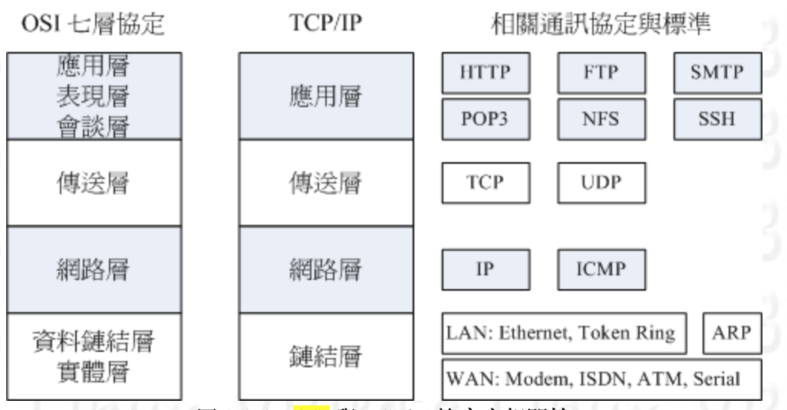

## 1、 TCP/IP 和 OSI分層協定

## 2、TCP(Transmission Control Protocol)

雙向傳輸協議，在發送封包前會先和對方建立可靠的連接，也是三次握手。在傳送資料是有序的，遺失會重傳的，確保對方有收到資料。

## 3、UDP（User DataGram Protocol)

單向傳輸，在傳送封包前不需與對方建立連線，直接發送，不管對方是否有收到，效率較高。
