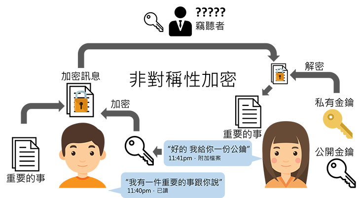
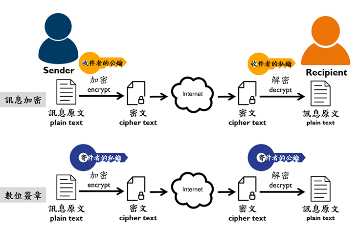
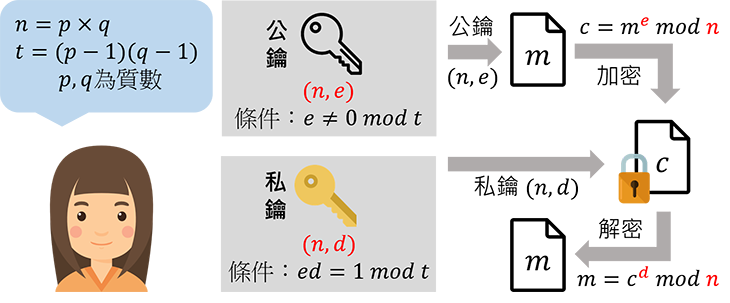

##密碼演算法最基礎由這兩種方式演變:

- 換位演算
- 換值演算

##為什麼需要加解密
在模仿遊戲這部電影，來到二次世界大戰，也就是計算機之父 Alan Mathison Turing，
為故事背景，德國在戰爭中通訊是利用恩尼格瑪密碼機將明文加密後傳輸，這當時是號稱無法破譯的加密算法，
每日key只要過0點都會重新置換，所以破譯只能每天重新來過，導致聯合軍當時只能看到一堆加密過後的文字，
並不能阻止對方的軍事行動。故事最後是成功解密了，但也徹底明白密碼學的重要性。

##加解密的構成
加解密的具體運作由兩部分決定：一個是演算法，另一個是金鑰。金鑰是一個用於加解密演算法的秘密參數，通常只有通訊者擁有。

##加密強度要素
– 演算法強度 – 金鑰保護機制 – 金鑰的長度

加密技術的強度指的是密碼破解所需要花費的時間與資源。

##密碼學
必須包含:
- 機密性(Confidentiality)：確保訊息只有被授權者才能取得
- 完整性(Integrity)：偵測訊息是否遭受竄改
- 身分認證(Authentication)：傳送方與接受方需驗證識別
- 不可否認性(Non-Reputation)：提供訊息傳送方與接受方的交易證明

##對稱加密技術(傳統加密)
訊息的加密和解密採用相同的金鑰  
需要傳送和接收雙方均擁有相同的一把金鑰  
- 優點: 
>較快速
>如果使用足夠大的金鑰，將難以破解。
- 缺點: 需要有一個安全性機制將金鑰安全性的分送至交易的雙方。
>提供私密性(Confidential)的安全性能力，無法提供不可否認的能力。

##常見對稱加密演算法:
- DES
- 3DES
- AES
- Blowfish
- IDEA
- RC5
- RC6

##非對稱加密技術(Asymmetric Encryption；Public Key Encryption)
– 每個使用者都擁有一對金鑰：公開金鑰(Public key)及私密金鑰(Private key)，
公開金鑰能被廣泛的發佈與流傳，而私密金鑰則必須被妥善的保存；當訊息由其中一把金鑰加密後，
就必須用另一把金鑰解密，加解密的鑰匙要是完整一對(pair)的，所以可以是公鑰加密私鑰解密，
也可以是私鑰加密公鑰解密。

##非對稱加密演算法應用

- 優點:
>公開鑰匙可以公開分送
提供 私密性、驗證與不可否認性等服務

- 缺點：
>效率較差

##常見公開金鑰演算法:
- RSA:使用最廣泛的演算法，由羅納德·李維斯特（Ron Rivest）、阿迪·薩莫爾（Adi Shamir）
和倫納德·阿德曼（Leonard Adleman）一起提出的。藉由歐拉定理推導出，目前建議key的長度為2048bits。

- 迪菲－赫爾曼金鑰交換協定中的公鑰加密演算法(Diffie-Hellman,DH)
- ElGamal
- 背包演算法
- Rabin（RSA的特例）
- 橢圓曲線加密演算法（Elliptic Curve Cryptography,ECC）
- 雜湊演算法(Hashing)
是電腦科學中一種對資料的處理方法，通過某種特定的函式/演算法（稱為雜湊函式/演算法）
將要檢索的項與用來檢索的索引（雜湊值）關聯起來，生成一種便於搜尋的資料結構（稱為雜湊表）。
它也常用作一種資訊安全的實作方法，由一串資料中經過雜湊演算法（Hashing algorithms）
計算出來的資料指紋(特徵)，經常用來識別檔案與資料是否有被竄改，
以保證檔案與資料確實是由原創者所提供。

如今，雜湊演算法也被用來加密存在資料庫中的密碼字串，由於雜湊演算法所計算出來的雜湊值（Hash Value）具有不可逆（無法逆向演算回原本的數值）的性質，因此可有效的保護密碼。

##常見的雜湊演算法
- MD5
- SHA-2
- HAVAL
- MD2
- MD4

##數位簽章(Digital Signature)
也就是傳送方除了使用接收方的公鑰加密外，也使用自己的私鑰對該封加密訊息的Hash簽名，
這樣當接收方收到時，除了要使用接收方本身的私鑰解密，也需要用寄件者的公鑰來對簽章作二次驗證，
確認真的是由正確的傳送者傳來的。

##憑證管理中心(Certification Authority)
為了使公開金鑰密碼系統得以順利運作，必需設法緊密結合並證明某一把公開金鑰確實為某人或某單位所擁有，
讓他人無法假冒、偽造。 解決方法是模仿印鑑證明的方式，
由可信賴的第三者或機構(Trusted Third Parity)來當作公 鑰授權單位，
以簽發公鑰電子憑證的方式來證明公鑰的效力。  
CA就是一個用來提供發行、撤銷管理憑證的服務單位。
可由政府、商業機構或組織內自行架設以提供各項憑證相關的服務。

##憑證(Certificates)
數位憑證是一份經由CA簽章的電子文件。
用來證明公開金鑰和特定的個人或單位(擁有者)的連繫關係。
憑證內容包括使用者名稱、公開金鑰、發證者、生效和到期日期、擁有者等資訊。
