# 五、Docker

## 1、簡介

Docker是一個開源的應用容器引擎

將軟件編譯成一個鏡像；然後在鏡像里各種軟件做好配置，將鏡像發布出去，其他的使用這就可以直接使用這個鏡像。運行中的這個鏡像叫做容器，容器啟動速度快，類似ghost操作系統，安裝好了什麽都有了；

## 2、Docker的核心概念

docker主機（HOST）:安裝了Docker程序的機器（Docker直接安裝在操作系統上的）

docker客戶端（Client）:操作docker主機

docker倉庫（Registry）：用來保存打包好的軟件鏡像

docker鏡像（Image）:軟件打好包的鏡像，放到docker的倉庫中

docker容器（Container）:鏡像啟動後的實例（5個容器啟動5次鏡像）

docker的步驟：

```
1、安裝Docker

2、去Docker倉庫找到這個軟件對應的鏡像；

3、使用Docker運行的這個鏡像，鏡像就會生成一個容器

4、對容器的啟動停止，就是對軟件的啟動和停止

```

## 3、安裝Docker

### 1、安裝Linux

[安裝vxbox並且安裝ubuntu](http://note.youdao.com/noteshare?id=06ccb673d253fea78fe35430465758e1)

### 2、在linux上安裝docker

```shell
1、查看centos版本
# uname -r
3.10.0-693.el7.x86_64
要求：大於3.10
如果小於的話升級*（選做）
# yum update
2、安裝docker
# yum install docker
3、啟動docker
# systemctl start docker
# docker -v
4、開機啟動docker
# systemctl enable docker
5、停止docker
# systemctl stop docker

```

## 4、docker的常用操作

### 1、鏡像操作

1、搜索

```shell
docker search mysql
```

默認去docker hub網站查找

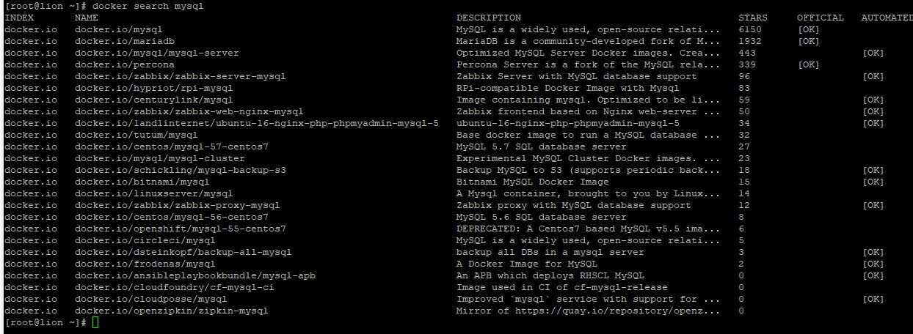

2、拉取

```shell
默認最新版本
# docekr pull mysql
安裝指定版本
# docker pull mysql:5.5
```

3、查看

```shell
docker images
```

4、刪除

```
docker rmi imageid
```

### 2、容器操作

軟件的鏡像（qq.exe） -- 運行鏡像 -- 產生一個容器（正在運行的軟件）

```shell
1、搜索鏡像
# docker search tomcat
2、拉取鏡像
# docker pull tomcat
3、根據鏡像啟動容器
[root@lion ~]# docker images
REPOSITORY          TAG                 IMAGE ID            CREATED             SIZE
docker.io/tomcat    latest              d3d38d61e402        35 hours ago        549 MB
[root@lion ~]# docker run --name mytomcat -d tomcat:latest
2f0348702f5f2a2777082198795d8059d83e5ee38f430d2d44199939cc63e249
4、查看那個進程正在進行
[root@lion ~]# docker ps
CONTAINER ID        IMAGE               COMMAND             CREATED             STATUS              PORTS               NAMES
2f0348702f5f        tomcat:latest       "catalina.sh run"   41 seconds ago      Up 39 seconds       8080/tcp            mytomcat
5、停止運行中容器
[root@lion ~]# docker stop 2f0348702f5f
2f0348702f5f
6、查看所有容器
[root@lion ~]# docker ps -a
CONTAINER ID        IMAGE               COMMAND             CREATED             STATUS                       PORTS               NAMES
2f0348702f5f        tomcat:latest       "catalina.sh run"   52 minutes ago      Exited (143) 2 minutes ago                       mytomcat
7、啟動容器
[root@lion ~]# docker start 2f0348702f5f
8、刪除docker容器
[root@lion ~]# docker rm 2f0348702f5f
2f0348702f5f
9、端口映射
[root@lion ~]# docker run --name mytomcat -d -p 8888:8080 tomcat
692c408c220128014df32ecb6324fb388427d1ecd0ec56325580135c58f63b29
虛擬機:8888
容器的:8080
-d:後臺運行
-p:主機端口映射到容器端口
瀏覽器：192.168.179.129:8888
10、docker的日誌
[root@lion ~]# docker logs 692c408c2201
11、多個啟動
[root@lion ~]# docker run -d -p 9000:8080 --name mytomcat2 tomcat
瀏覽器：192.168.179.129:9000
```

更多命令參考docker鏡像文檔

### 3、安裝Mysql

```shell
docker pull mysql
docker run --name mysql001 -e MYSQL_ROOT_PASSWORD -d -p 3307:3306 mysql
```

# 六、數據訪問

## 1、整合JDBC數據源

1、新建項目 spring-boot-06-data-jdbc

- WEB
- Mysql
- JDBC
- SpringBoot1.5

2、編寫配置文件appliction.yml

```yaml
spring:
  datasource:
    username: root
    password: Welcome_1
    url: jdbc:mysql://192.168.179.131:3306/jdbc
    driver-class-name: com.mysql.jdbc.Driver
```

3、編寫測試類測試

```java
@RunWith(SpringRunner.class)
@SpringBootTest
public class SpringBoot06DataJdbcApplicationTests {

    @Autowired
    DataSource dataSource;

    @Test
    public void contextLoads() throws SQLException {
        System.out.println(dataSource.getClass());

        Connection connection = dataSource.getConnection();
        System.out.println(connection);
        connection.close();
    }

}
```

4、測試結果

```
class org.apache.tomcat.jdbc.pool.DataSource
ProxyConnection[PooledConnection[com.mysql.jdbc.JDBC4Connection@c35af2a]]
```

數據源相關配置都在DataSourceProperties屬性里

自動配置原理

E:\Develop\Maven_Repo\org\springframework\boot\spring-boot-autoconfigure\1.5.13.RELEASE\spring-boot-autoconfigure-1.5.13.RELEASE.jar!\org\springframework\boot\autoconfigure\jdbc

### 1、DataSource

參考DataSourceConfiguration,根據配置創建數據源，默認是使用tomcat連接池，可以使用spring.datasource.type指定自定義的數據源

### 2、SpringBoot默認支持

```
Tomcat數據源
HikariDataSource
dbcp.BasicDataSource
dbcp2.BasicDataSource
```

### 3、自定義數據源

```java
 */
@ConditionalOnMissingBean(DataSource.class)
@ConditionalOnProperty(name = "spring.datasource.type")
static class Generic {

   @Bean
   public DataSource dataSource(DataSourceProperties properties) {
       //使用builder創建數據源，利用反射創建相應的type數據源，並綁定數據源
      return properties.initializeDataSourceBuilder().build();
   }

}
```

### 4、運行sql建表

在DataSourceAutoConfiguration中**DataSourceInitializer**類

監聽器

作用：

1）、postConstruct -》runSchemaScript 運行建表sql文件

2）、runDataScript運行插入數據的sql語句；

默認只需要將文件命名為：

```sql
schema-*.sql data-*.sql
默認規則：schema.sql ,schema-all.sql;
```

**舉個栗子**

創建department表

1、department.sql

```sql
/*
Navicat MySQL Data Transfer

Source Server         : 192.168.179.131
Source Server Version : 50719
Source Host           : 192.168.179.131:3306
Source Database       : jdbc

Target Server Type    : MYSQL
Target Server Version : 50719
File Encoding         : 65001

Date: 2018-05-14 14:28:52
*/

SET FOREIGN_KEY_CHECKS=0;

-- ----------------------------
-- Table structure for department
-- ----------------------------
DROP TABLE IF EXISTS `department`;
CREATE TABLE `department` (
  `id` int(11) NOT NULL AUTO_INCREMENT,
  `departmentName` varchar(255) DEFAULT '',
  PRIMARY KEY (`id`)
) ENGINE=InnoDB DEFAULT CHARSET=utf8;

```

2、將department.sql命名為schema-all.sql

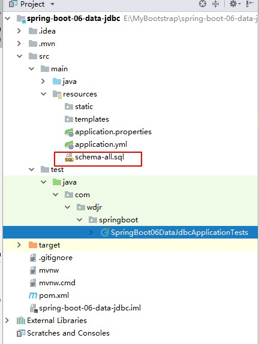

3、運行測試類

自定義sql的文件名，department.sql在配置文件中

```yaml
schema:
  - classpath:department.sql

```

------

### 5、操作JdbcTemplate

**FBI warning**:將department.sql刪除或者改名，因為運行文件會將表中數據清除

1、新建一個Controller

```java
@Controller
public class HelloController {

    @Autowired
    JdbcTemplate jdbcTemplate;

    @ResponseBody
    @GetMapping("/hello")
    public Map<String ,Object> hello(){

        List<Map<String, Object>> list = jdbcTemplate.queryForList("select * from department");
        return list.get(0);
    }
}
```

2、表中添加數據

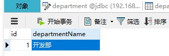


3、訪問請求查詢數據

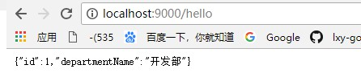


## 2、自定義數據源

1、導入Druid的依賴

```xml
<!-- https://mvnrepository.com/artifact/com.alibaba/druid -->
<dependency>
    <groupId>com.alibaba</groupId>
    <artifactId>druid</artifactId>
    <version>1.1.9</version>
</dependency>

```

2、修改配置文件

```yaml
spring:
  datasource:
    username: root
    password: Welcome_1
    url: jdbc:mysql://192.168.179.131:3306/jdbc
    driver-class-name: com.mysql.jdbc.Driver
    type: com.alibaba.druid.pool.DruidDataSource
#    schema:
#      - classpath:department.sql
server:
  port: 9000

```

已經替換了原來的tomcat數據源

3、配置Druid數據源配置

```yaml
spring:
  datasource:
    username: root
    password: Welcome_1
    url: jdbc:mysql://192.168.179.131:3306/jdbc
    driver-class-name: com.mysql.jdbc.Driver
    type: com.alibaba.druid.pool.DruidDataSource
	# 初始化大小，最小，最大  
    initialSize: 5
    minIdle: 5
    maxActive: 20
    # 配置獲取連接等待超時的時間  
    maxWait: 60000
    # 配置間隔多久才進行一次檢測，檢測需要關閉的空閑連接，單位是毫秒 
    timeBetweenEvictionRunsMillis: 60000
    # 配置一個連接在池中最小生存的時間，單位是毫秒 
    minEvictableIdleTimeMillis: 300000
    validationQuery: SELECT 1 FROM DUAL
    testWhileIdle: true
    testOnBorrow: false
    testOnReturn: false
    poolPreparedStatements: true
    # 配置監控統計攔截的filters,去掉監控界面sql無法統計，‘wall’用於防火墻
    filters: stat,wall,log4j
    maxPoolPreparedStatementPerConnectionSize: 20
    userGlobalDataSourceStat: true
    # 通過connectProperties屬性來打開mergeSql功能；慢SQL記錄  
    connectionProperties: druid.stat.mergeSql=true;druid.stat.slowSqlMillis=500
#    schema:
#      - classpath:department.sql
server:
  port: 9000
```

4、Druid配置監控

```java
@Configuration
public class DruidConfig {

    @ConfigurationProperties(prefix = "spring.datasource")
    @Bean
    public DataSource druid(){
        return  new DruidDataSource();
    }

    //配置Druid的監控
    //1、配置一個管理後臺
    @Bean
    public ServletRegistrationBean statViewServlet(){
        ServletRegistrationBean bean = new ServletRegistrationBean(new StatViewServlet(),"/druid/*");
        Map<String,String> initParams =new HashMap<>();
        initParams.put("loginUsername", "admin");
        initParams.put("loginPassword", "123456");
        bean.setInitParameters(initParams);
        return bean;
    }
    //2、配置監控的filter
    @Bean
    public FilterRegistrationBean webstatFilter(){
        FilterRegistrationBean bean = new FilterRegistrationBean();
        bean.setFilter(new WebStatFilter());

        Map<String,String> initParams =new HashMap<>();
        initParams.put("exclusions", "*.js,*.css,/druid/*");
        bean.setInitParameters(initParams);
        bean.setUrlPatterns(Arrays.asList("/*"));
        return bean;
    }

}
```

5、運行測試，訪問 localhost:9000/druid

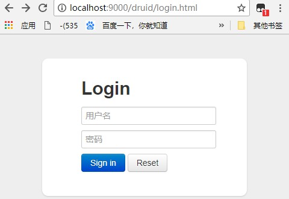

輸入剛才調好的用戶名密碼即可訪問

## 3、整合Mybatis

1、新建工程，SpringBoot1.5+web+JDBC+Mysql

導入依賴

```xml
<dependency>
    <groupId>org.mybatis.spring.boot</groupId>
    <artifactId>mybatis-spring-boot-starter</artifactId>
    <version>1.3.2</version>
</dependency>
<!-- https://mvnrepository.com/artifact/com.alibaba/druid -->
<dependency>
    <groupId>com.alibaba</groupId>
    <artifactId>druid</artifactId>
    <version>1.1.9</version>
</dependency>
<dependency>
    <groupId>mysql</groupId>
    <artifactId>mysql-connector-java</artifactId>
    <scope>runtime</scope>
</dependency>
<dependency>
    <groupId>org.springframework.boot</groupId>
    <artifactId>spring-boot-starter-jdbc</artifactId>
</dependency>

```

2、導入配置文件中關於Druid的配置

```
2.1、導入依賴

2.2、配置文件application.yml（指定用戶名密碼...配置Druid的配置參數，修改sql文件加載的默認名）

2.3、將Druid組件加入到容器中（監控）重點

具體同上

```

3、創建數據表department和employee表

```
3.1、根據sql文件，新建兩張表

3.2、修改加載的sql名（默認為schema.sql和schema-all.sql）

```

```yaml
spring:
  datasource:
    schema:
      - classpath:sql/department.sql
      - classpath:sql/employeee.sql

```

```
3.3、運行程序檢查數據庫是否創建成功

```

4、創建數據庫對應的JavaBean （駝峰命名，getter/setter toString/註釋掉schema防止重複創建） 

在配置文件中修改駝峰命名開啟 ,不寫配置文件就寫配置類

```yaml
mybatis:
  configuration:
    map-underscore-to-camel-case: true

```

```java
//類名沖突所以全類名
@org.springframework.context.annotation.Configuration
public class MyBatisConfig {

    @Bean
    public ConfigurationCustomizer configurationCustomizer(){

        return new ConfigurationCustomizer() {
            @Override
            public void customize(Configuration configuration) {
                configuration.setMapUnderscoreToCamelCase(true);
            }
        };
    }
}

```

### 註解方式

5、新建mapper

```yaml
//指定是一個mapper
@Mapper
public interface DepartmentMapper {

    @Insert("insert into department(dept_name) value(#{deptName})")
    public int insertDept(Department department);

    @Delete("delete from department where id=#{id}")
    public int deleteDeptById(Integer id);

    @Update("update department set dept_Name=#{deptName} where id=#{id}")
    public int updateDept(Department department);

    @Select("select * from department where id=#{id}")
    public Department getDeptById(Integer id);

}

```

6、編寫controller測試

```java
@RestController
public class DeptController {

    @Autowired
    DepartmentMapper departmentMapper;

    @RequestMapping("/getDept/{id}")
    public Department getDepartment(@PathVariable("id") Integer id){
        return departmentMapper.getDeptById(id);
    }

    @RequestMapping("/delDept/{id}")
    public int delDept(@PathVariable("id") Integer id){
        return departmentMapper.deleteDeptById(id);
    }

    @RequestMapping("/update/{id}")
    public int updateDept(@PathVariable("id") Integer id){
        return departmentMapper.updateDept(new Department(id, "開發部"));
    }

    @GetMapping("/insert")
    public int insertDept(Department department){
        return departmentMapper.insertDept(department);
    }
}

```

問題：

mapper文件夾下有多個mapper文件，加麻煩，可以直接掃描整個mapper文

件夾下的mapper

```java
//主配置類或者mybatis配置類
@MapperScan(value = "com.wdjr.springboot.mapper")

```

### 配置文件方式

1、新建文件

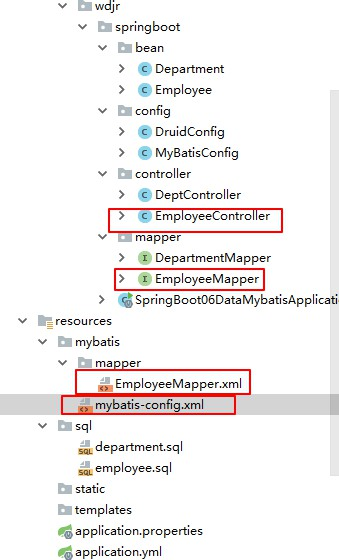

2、新建mybatis的配置文件

```xml
<?xml version="1.0" encoding="UTF-8" ?>
<!DOCTYPE configuration
        PUBLIC "-//mybatis.org//DTD Config 3.0//EN"
        "http://mybatis.org/dtd/mybatis-3-config.dtd">
<configuration>
    <settings>
        <setting name="mapUnderscoreToCamelCase" value="true"/>
    </settings>
</configuration>

```

3、新建Employee的接口方法

```java
public interface EmployeeMapper {

    public Employee getEmpById(Integer id);

    public void insetEmp(Employee employee);
}

```

4、新建Employee的mapper.xml的映射文件

```xml
<?xml version="1.0" encoding="UTF-8" ?>
<!DOCTYPE mapper
        PUBLIC "-//mybatis.org//DTD Mapper 3.0//EN"
        "http://mybatis.org/dtd/mybatis-3-mapper.dtd">
<mapper namespace="com.wdjr.springboot.mapper.EmployeeMapper">
    <select id="getEmpById" resultType="com.wdjr.springboot.bean.Employee">
      select * from employee where id=#{id}
   </select>

    <insert id="insetEmp">
        INSERT  INTO employee(last_name,email,gender,d_id) VALUES (#{lastName},#{email},#{gender},#{dId})
    </insert>
</mapper>
```

5、修改application.yml配置文件

```yaml
mybatis:
  config-location: classpath:mybatis/mybatis-config.xml
  mapper-locations: classpath:mybatis/mapper/*.xml
```

6、新建一個Controller訪問方法

```java
@RestController
public class EmployeeController {
    @Autowired
    EmployeeMapper employeeMapper;

    @RequestMapping("/getEmp/{id}")
    public Employee getEmp(@PathVariable("id") Integer id){
        return employeeMapper.getEmpById(id);
    }

    @GetMapping("/insertEmp")
    public Employee insertEmp(Employee employee){
        employeeMapper.insetEmp(employee);
        return employee;
    }
}
```

## 4、JPA數據訪問

新建工程 springBoot1.5+Web+JPA+MYSQL+JDBC

目錄結構

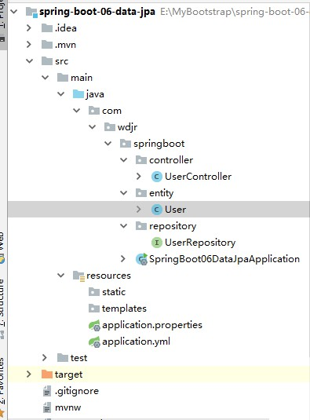


1、新建一個實體類User

```java
//使用JPA註解配置映射關系
@Entity//告訴JPA這是一個實體類（和數據表映射的類）
@Table(name="tbl_user") //@Table來指定和那個數據表對應，如果省略默認表明就是user;

public class User {

    @Id //這是一個主鍵
    @GeneratedValue(strategy = GenerationType.IDENTITY)//自增組件
    private Integer id ;

    @Column(name="last_name",length = 50) //這是和數據表對應的一個列
    private String lastName;
    @Column//省略默認列名就是屬性名
    private String email;
    @Column
    public Integer getId() {
        return id;
    }

    public void setId(Integer id) {
        this.id = id;
    }

    public String getLastName() {
        return lastName;
    }

    public void setLastName(String lastName) {
        this.lastName = lastName;
    }

    public String getEmail() {
        return email;
    }

    public void setEmail(String email) {
        this.email = email;
    }
}

```

2、新建一個UserRepository來繼承jpa的絕大多數功能

```java
//繼承jpaRepository
public interface UserRepository extends JpaRepository<User,Integer> {

}

```

3、編寫配置文件application.yml

```yaml
spring:
  datasource:
    url: jdbc:mysql://192.168.179.131/jpa
    username: root
    password: Welcome_1
    driver-class-name: com.mysql.jdbc.Driver
  jpa:
    hibernate:
    #更新或創建
      ddl-auto: update
    show-sql: true

```

4、編寫Controller測試

```java
@RestController
public class UserController {
    @Autowired
    UserRepository userRepository;

    @GetMapping("/user/{id}")
    public User getUser(@PathVariable("id") Integer id){
        User user = userRepository.findOne(id);
        return user;
    }

    @GetMapping("/insert")
    public User insertUser(User user){
        User user1 = userRepository.save(user);
        return  user1;
    }
}

```

# 七、啟動配置原理

幾個重要的事件回調機制

加載配置文件META-INF/spring.factories

```
ApplicationContextInitializer

SpringApplicationRunListener

```

ioc容器中

```
ApplicationRunner

CommandLineRunner

```

啟動流程

## 1、創建SpringApplicaiotn對象   

```java
private void initialize(Object[] sources) {
    //保存主配置類
   if (sources != null && sources.length > 0) {
      this.sources.addAll(Arrays.asList(sources));
   }
    //判斷當前是否是個web應用
   this.webEnvironment = deduceWebEnvironment();
    //從類路徑下找到META-INF/spring.factories配置中的所有ApplicationInitializer 然後保存起來
   setInitializers((Collection) getSpringFactoriesInstances(
         ApplicationContextInitializer.class));
    //從類路徑下找到META-INF/spring.factories配置中的所有ApplicationListener 然後保存起來
   setListeners((Collection) getSpringFactoriesInstances(ApplicationListener.class));
    //決定哪一個是主程序
   this.mainApplicationClass = deduceMainApplicationClass();
}

```

ApplicationInitializer


 ApplicationListener


## 2、運行Run方法

```java
public ConfigurableApplicationContext run(String... args) {
   StopWatch stopWatch = new StopWatch();
   stopWatch.start();
   ConfigurableApplicationContext context = null;
   FailureAnalyzers analyzers = null;
   configureHeadlessProperty();
    //獲取SpringApplicationRunListeners;從類路徑下META-INF/spring.factory
   SpringApplicationRunListeners listeners = getRunListeners(args);
    //回調所有的SpringApplicationRunListener.starting()方法
   listeners.starting();
   try {
       //封裝命令行參數
      ApplicationArguments applicationArguments = new DefaultApplicationArguments(
            args);
       //準備環境
      ConfigurableEnvironment environment = prepareEnvironment(listeners,
            applicationArguments);
       //創建環境，完成後回調SpringApplicationRunListener.environmentPrepared環境準備完成
       //打印SpringBoot圖標
      Banner printedBanner = printBanner(environment);
       //創建ApplicationContext，決定創建web的ioc容器還是普通的ioc
      context = createApplicationContext();
       //異常分析
      analyzers = new FailureAnalyzers(context);
       //重點：將environment保存的ioc中，applyInitializers初始化器上面那6個的獲取，並且回調ApplicationContextInitializer.initialize方法
       
       //回調所有的SpringApplicationRunListener的contextPrepare()
       //告訴prepareContext運行完成以後回調所有的SpringApplicationRunListener的contextLoaded
      prepareContext(context, environment, listeners, applicationArguments,
            printedBanner);
       //重要：刷新所有組件 ioc容器初始化，如果是web應用還會創建嵌入式的tomcat
       //掃描 創建加載所有組件的地方
      refreshContext(context);
       //從ioc中獲取所有的ApplicationRunner和CommandLineRunner
       //ApplicationRunner先回調
      afterRefresh(context, applicationArguments);
       //所有的SpringApplicationRunListener回調finished方法
      listeners.finished(context, null);
       //保存應用狀態
      stopWatch.stop();
      if (this.logStartupInfo) {
         new StartupInfoLogger(this.mainApplicationClass)
               .logStarted(getApplicationLog(), stopWatch);
      }
       //整個springboot啟動完成以後返回啟動的ioc容器
      return context;
   }
   catch (Throwable ex) {
      handleRunFailure(context, listeners, analyzers, ex);
      throw new IllegalStateException(ex);
   }
}
```

## 3、事件監聽機制

新建listener監聽

文件目錄


1、HelloApplicationContextInitializer

```java
//泛型監聽ioc容器
public class HelloApplicationContextInitializer implements ApplicationContextInitializer<ConfigurableApplicationContext> {
    @Override
    public void initialize(ConfigurableApplicationContext applicationContext) {
        System.out.println("ApplicationContextInitializer...跑起來了....."+applicationContext);
    }
}
```

2、HelloSpringApplicationRunListener

加構造器

```java
public class HelloSpringApplicationRunListener implements SpringApplicationRunListener {

    public HelloSpringApplicationRunListener(SpringApplication application, String[] args){

    }

    @Override
    public void starting() {
        System.out.println("監聽容器開始......");
    }

    @Override
    public void environmentPrepared(ConfigurableEnvironment environment) {
        System.out.println("環境準備好了......"+environment.getSystemProperties().get("os.name"));
    }

    @Override
    public void contextPrepared(ConfigurableApplicationContext context) {
        System.out.println("ioc容器準備好了......");
    }

    @Override
    public void contextLoaded(ConfigurableApplicationContext context) {
        System.out.println("容器環境已經加載完成......");
    }

    @Override
    public void finished(ConfigurableApplicationContext context, Throwable exception) {
        System.out.println("全部加載完成......");
    }
}

```

3、HelloApplicationRunner

```java
@Component
public class HelloApplicationRunner implements ApplicationRunner {
    @Override
    public void run(ApplicationArguments args) throws Exception {
        System.out.println("ApplicationRunner.....run....");
    }
}
```

4、HelloCommandLineRunner

```java
@Component
public class HelloCommandLineRunner implements CommandLineRunner {
    @Override
    public void run(String... args) throws Exception {
        System.out.println("CommandLineRunner......run....."+Arrays.asList(args));
    }
}
```

事件運行方法

HelloApplicationContextInitializer和HelloSpringApplicationRunListener文件META-INF/spring.factories中加入

```
# Initializers
org.springframework.context.ApplicationContextInitializer=\
com.wdjr.springboot.listener.HelloApplicationContextInitializer

org.springframework.boot.SpringApplicationRunListener=\
com.wdjr.springboot.listener.HelloSpringApplicationRunListener
```

HelloApplicationRunner和HelloCommandLineRunner ioc加入

@Component

# 八、SpringBoot的自定義starter

starter：場景啟動器

1、場景需要使用什麽依賴？

2、如何編寫自動配置

```java
@Configuration //指定這個類是一個配置類
@ConditionalOnXXX //在指定條件下成立的情況下自動配置類生效
@AutoConfigureAfter //指定自動配置類的順序
@Bean //給容器中添加組件

@ConfigurationProperties //結合相關xxxProperties類來綁定相關的配置
@EnableConfigurationProperties //讓xxxProperties生效加到容器中

自動配置類要能加載
將需要啟動就加載的自動配置類，配置在META-INF/spring.factories
# Auto Configure
org.springframework.boot.autoconfigure.EnableAutoConfiguration=\
org.springframework.boot.autoconfigure.admin.SpringApplicationAdminJmxAutoConfiguration,\
org.springframework.boot.autoconfigure.aop.AopAutoConfiguration,\

```

3、模式

啟動器空的jar只需要做依賴管理導入；

專門寫一個自動配置模塊；

啟動器依賴自動配置，別人只需要引入starter

xxx-spring-boot-starter

### 新建一個starter

> 繞的你懷疑人生

#### 1、新建一個空項目工程

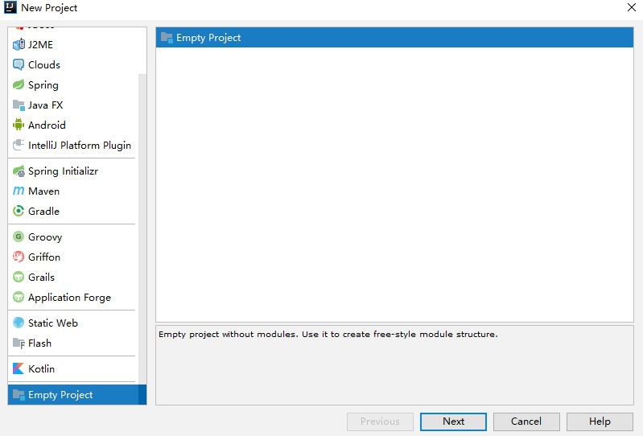

2、項目命名

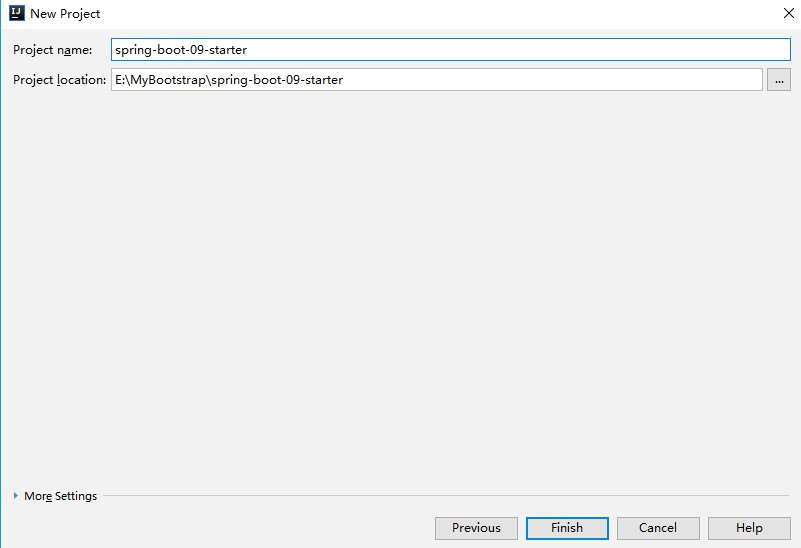


3、導入module


4、新建一個Maven工程

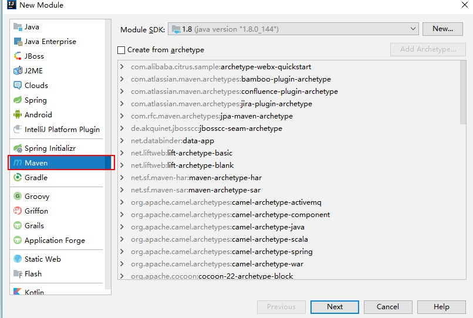

5、項目命名


6、在新建一個autoconfiguration類的spring

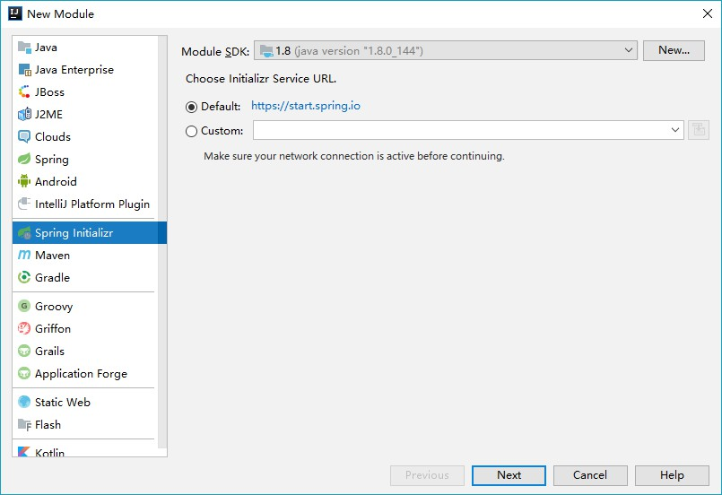

7、項目命名


8、無需導入依賴

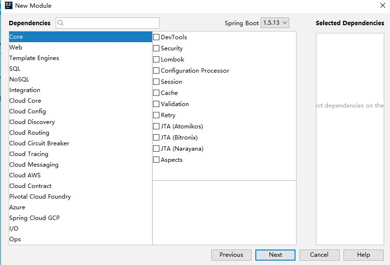

9、next

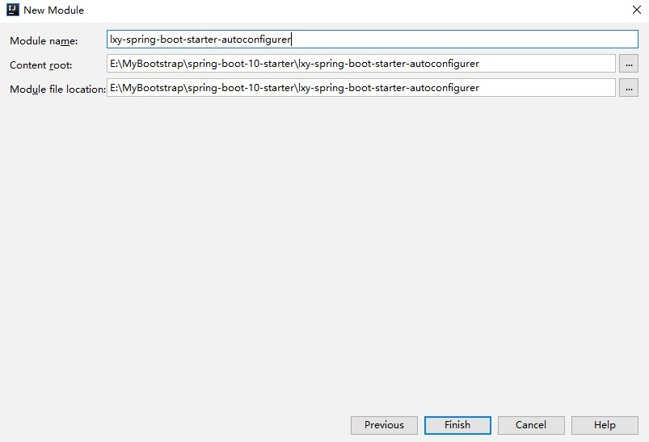

最後配置完成

#### 2、編寫starter

##### autoconfigurer

對**lxy-spring-boot-starter-autoconfigurer**進行刪減

目錄

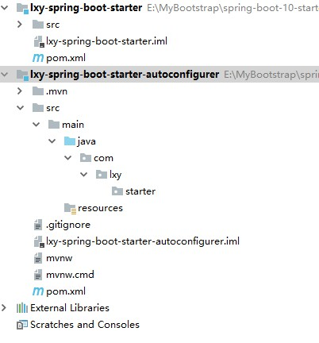

2、pom文件修改

```xml
    <dependencies>
        <dependency>
            <groupId>org.springframework.boot</groupId>
            <artifactId>spring-boot-starter</artifactId>
        </dependency>

    </dependencies>


</project>

```

3、編寫相關的類


4、HelloProperties

```java
package com.lxy.starter;


import org.springframework.boot.context.properties.ConfigurationProperties;

@ConfigurationProperties(prefix = "lxy.hello")
public class HelloProperties {
    private String prefix;
    private String suffix;

    public String getPrefix() {
        return prefix;
    }

    public void setPrefix(String prefix) {
        this.prefix = prefix;
    }

    public String getSuffix() {
        return suffix;
    }

    public void setSuffix(String suffix) {
        this.suffix = suffix;
    }
}

```

5、HelloService

```java
package com.lxy.starter;

public class HelloService {

    HelloProperties helloProperties;

    public HelloProperties getHelloProperties() {
        return helloProperties;
    }

    public void setHelloProperties(HelloProperties helloProperties) {
        this.helloProperties = helloProperties;
    }

    public String sayHello(String name){
        return helloProperties.getPrefix()+name+helloProperties.getSuffix();
    }
}

```

6、HelloServiceAutoConfiguration


```java
package com.lxy.starter;

import org.springframework.beans.factory.annotation.Autowired;
import org.springframework.boot.autoconfigure.condition.ConditionalOnWebApplication;
import org.springframework.boot.context.properties.EnableConfigurationProperties;
import org.springframework.context.annotation.Bean;
import org.springframework.context.annotation.Configuration;

@Configuration
@ConditionalOnWebApplication
@EnableConfigurationProperties(HelloProperties.class)
public class HelloServiceAutoConfiguration {

    @Autowired
    HelloProperties helloProperties;
    @Bean
    public HelloService helloService(){
        HelloService service = new HelloService();
        service.setHelloProperties(helloProperties);
        return service;
    }

}

```

7、配置文件

```
org.springframework.boot.autoconfigure.EnableAutoConfiguration=\
com.lxy.starter.HelloServiceAutoConfiguration

```

8、修改lxy-spring-boot-starter 也就是之前的Maven項目，修改pom文件引入autoconfiguration依賴

```xml
<dependencies>
    <dependency>
        <groupId>com.lxy.starter</groupId>
        <artifactId>lxy-spring-boot-starter-autoconfigurer</artifactId>
        <version>0.0.1-SNAPSHOT</version>
    </dependency>
</dependencies>

```

9、install生成


#### 3、測試

新建一個springboot 1.5+web

1、引入starter

```xml
    <dependency>
        <groupId>com.lxy.starter</groupId>
        <artifactId>lxy-spring-boot-starter</artifactId>
        <version>1.0-SNAPSHOT</version>
    </dependency>

</dependencies>
```

2、新建一個Controller用來測試

```java
@RestController
public class HelloController {

    @Autowired
    HelloService helloService;

    @GetMapping
    public  String hello(){
        return helloService.sayHello("test");
    }
}
```

3、編寫配置文件制定前綴和後綴名

```properties
lxy.hello.prefix=Starter-
lxy.hello.suffix=-Success
```

4、運行訪問http://localhost:8080/hello

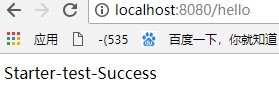

實作功能代碼：[spring-boot](https://github.com/kyocoolcool/spring-integration/tree/master/spring-boot-fundamentals)
