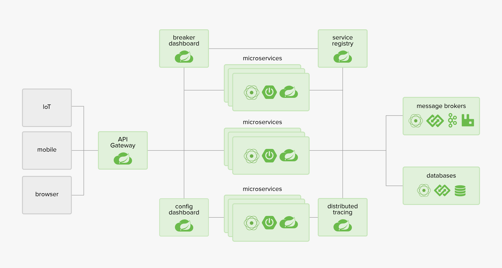

## 1、Spring Cloud

SpringCloud，基於SpringBoot提供了一套微服務解決方案，包括服務註冊與發現，配置中心，全鏈路監控，服務網關，負載均衡，熔斷器等組件，除了基於NetFlix的開源組件做高度抽象封裝之外，還有一些選型中立的開源組件。

SpringCloud利用SpringBoot的開發便利性巧妙地簡化了分佈式系統基礎設施的開發，SpringCloud為開發人員提供了快速構建分佈式系統的一些工具，包括配置管理、服務發現、斷路器、路由、微代理、事件匯流排、全局鎖、決策競選、分佈式會話等等,它們都可以用SpringBoot的開發風格做到一鍵啟動和部署。

SpringBoot並沒有重複製造輪子，它只是將目前各家公司開發的比較成熟、經得起實際考驗的服務框架組合起來，通過SpringBoot風格進行再封裝屏蔽掉了複雜的配置和實現原理，最終給開發者留出了一套簡單易懂、易部署和易維護的分佈式系統開發工具包

## 2、Spring Cloud與Spring Boot關係

SpringBoot專注於快速方便的開發單個個體微服務。
 SpringCloud是關注全局的微服務協調整理治理框架，它將SpringBoot開發的一個個單體微服務整合併管理起來，
為各個微服務之間提供，配置管理、服務發現、斷路器、路由、微代理、事件匯流排、全局鎖、決策競選、分佈式會話等等整合服務
SpringBoot可以離開SpringCloud獨立使用開發項目，但是SpringCloud離不開SpringBoot，屬於依賴的關係。
SpringBoot專注於快速、方便的開發單個微服務個體，SpringCloud關注全局的服務治理框架。

## 3、核心技術

模組

- Rest微服務構建案例工程模塊
- Eureka服務註冊與發現
- Ribbon負載均衡
- Feign負載均衡
- Hystrix熔斷器
- Zuul路由網關
- SpringCloud Config分布式配置中心

實作功能代碼：[spring-cloud](https://github.com/kyocoolcool/spring-integration/tree/master/spring-cloud-fundamentals)
