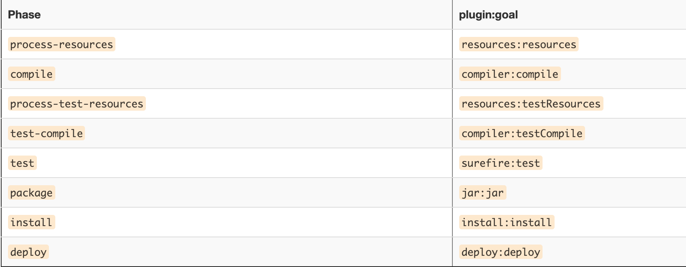
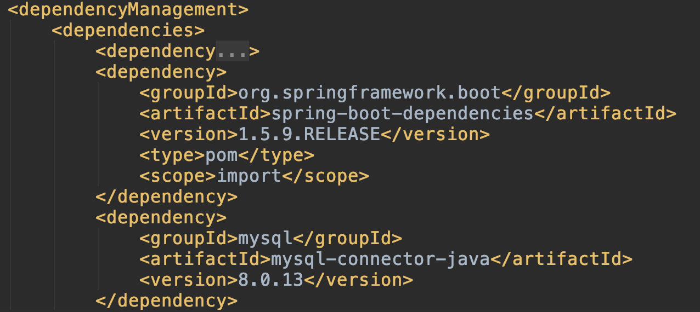
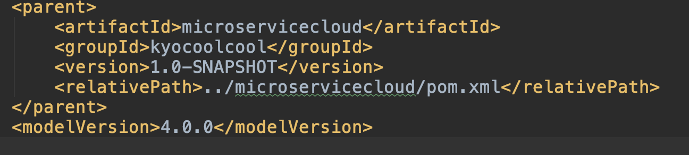
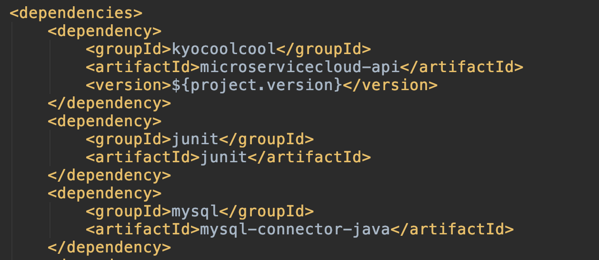
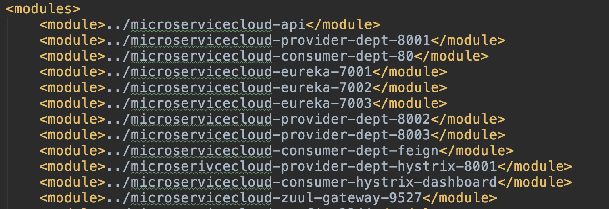

## 1、Maven介紹

Ｍaven，為Java自動構建工具依照項目的定義自動產出目錄結構並執行測試、編譯、打包、部署，解決繁雜的日常工作。

其核心只定義Life Cycle,需搭配Goal Plugin來做到相對應工作。如圖：

## 2、Dependency 延伸

可自動加入被依賴的jar檔,僅止於scope為compile。

## 3、繼承

父項目type為POM,子項目可以依需要導入jar檔,並由父項目統一管理版本號。

若想導入其他版本號也可自定義。

-父項目

-子項目

## 4、內聚
模組化，將各模組打包快速構建項目，提升模組的複用性。

