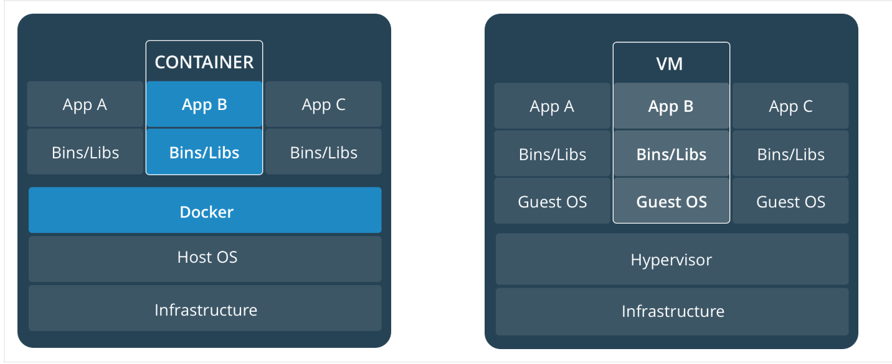
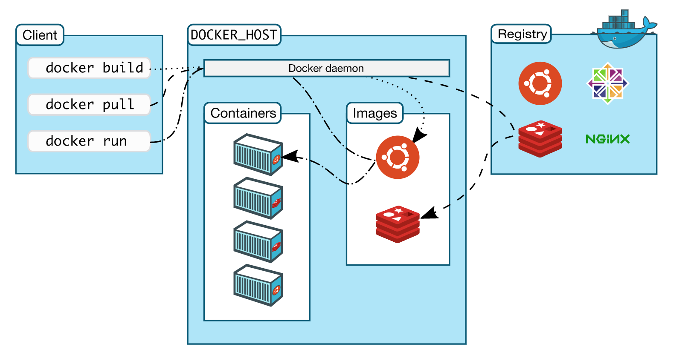
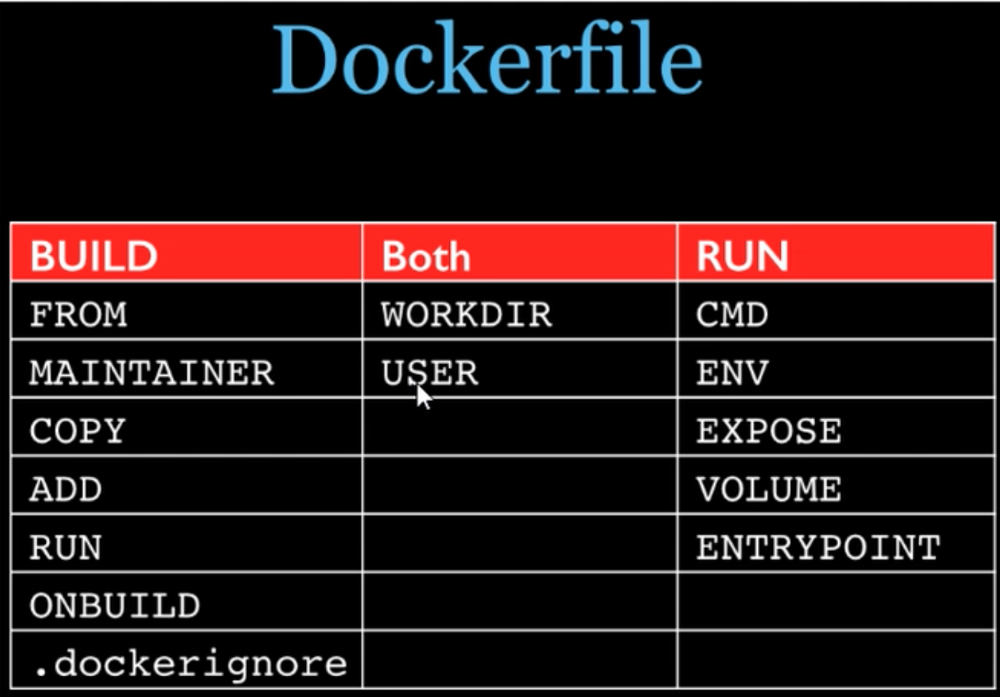

## 1、 About Docker

Docker provides a way to run applications securely isolated in a container, packaged with all its dependencies and libraries.

Docker 是在OS層上虛擬的容器應用平台，能夠快速地建立環境、啟動、部署，輕巧等特性，確實感到帶來的方便。

## 2、Container VS Virtual Machine

容器:之所以輕巧在於其僅虛擬化應用層，共用host的linux kernel，沒有加載整個作業系統，所以在啟動速度是屬於秒級。

採用Union Fils System 在images可以做很多環境上的疊加與分割。

虛擬機:是屬於硬體的虛擬化，運用Windos Hype-V技術 或是 Mac hyperkit ，在實體化的時候也包含整個作業系統環境，相對使用的資源較大，在啟動時會沒有相對於容器靈活，但在安全性的隔離優於容器。

在實際商業模式中兩者是屬於互助的同時存在。



## 3、Docker 為什麼能在Windos和Mac運行

Docker Container與Host Linux共用內核，但Windos與Ｍac並不是Linux OS，所以Docker 官網提供了Docker for mac及Docker for windows 版本，直接在Host上建立一個包含Docker 的Virtual Machine ，並直接設好環境參數，讓本機能夠直接對VM上的Docker進行操作。

## 4、Ｗhy User Docker

設想一個情境，當PG完成AP開發正常運行後，交由OP卻不能運行，常常查了老半天，原來是環境的關係，花了許久時間排除非專業的問題，因此Docker 的產生，能確保運行的環境，作業系統、環境變量、數據能夠一致，讓團隊成員能夠專心的做領域的工作，並且做到CI/CD。

## 5、Docker 如何運作 



## 6、Docker 指令筆記

> 鏡像構建紀錄

```shell
docker history 鏡像id
```

> 關閉容器
>

```shell
docker kill 容器id
```

> 刪除正在運行的容器

```shell
docker rm -f $(docker ps -q)
```

> 上傳鏡像

```shell
docker commit -a="作者" -m="提交的訊息描述" 容器ID 要創建的目標鏡像名:[標籤名]
EX:docker commit -a kyocoolcool -m "new mycentos1.4 with vim an ifconfig" 549d2d4dacfb mycentos:1.9
```

> 容器加入數據卷

```shell
docker run -it -v ${HOME}/宿主機絕對路徑目錄:/容器內目錄 鏡像名
```

Note: Docker for MAC 需要加${HOME}

> 容器加入數據卷(代權限)

```shell
docker run -it -v ${HOME}/宿主機絕對路徑目錄:/容器內目錄:ro 鏡像名
```

Note: ro=read only

> 利用DockerFile在容器中加入數據卷

```shell
docker build -f dockerFile文件位置 -t 公司名稱/項目 .
```

Note: 因為Docker for MAC是在Docker上執行Linux VM所以利用DockerFile是在VM上做volume

查看VM指令 screen /Users/chris/Library/Containers/com.docker.docker/Data/vms/0/tty

進入screen 即可對該VM操作 若要離開可執行Ctrl+A+K 離開

> 容器數據卷--雙向數據共享

```shell
docker run -it --name dc04 --volumes-from dc03 kyocoolcool/centos2
```

刪除父容器volume內的數據仍會存在直到沒有容器繼承才會無法消失

> dockerFile:構建Docker image的構建文件，是由一系列命令及參數構成的script

dockFile三步驟
1. 編寫dockerFile，必須要符合file規範
2. 有此文件後，直接docker build命令執行，獲得一個自定義image
3. run

> DockerFile指令

```dockerfile
### images來源

FROM centos

### 作者

MAINTAINER kyocoolcool<kyocoolcool@hotmail.com>

### 環境變量設置

ENV MYPATH /usr/local

### 登入後位置

WORKDIR $MYPATH

### 執行命令

RUN yum -y install vim
RUN yum -y install net-tools

### 對應的端口

EXPOSE 80

### CMD中間都會執行，但以最後一樣為容器執行的

CMD echo $MYPATH
CMD echo "success------ok"
CMD /bin/bash

### CMD與ENTRYPOINT 功能相同，差別在於ENTRYPOINT 可以搭配docker run 後的指令進行添加

ENTRYPOINT [ "curl" , "-s" , "https://ip.cn" ]

### ONBUILD 當父鏡像被繼承時會觸發此命令Trigger

ONBUILD RUN echo "Father images onbuild---666"

### 執行tomcat容器

docker run -d -p 8888:8080 --name myt9 -v /Users/chris/mydockerfile/tomcat9/test:/usr/local/apache-tomcat-9.0.22/webapps/test -v /Users/chris/mydockerfile/tomcat9/tomcat9logs:/usr/local/apache-tomcat-9.0.22/logs/ myt9

### mySql 容器執行

docker run -d -p 12345:3306 --name mysql -v ~/kyocoolcool/mysql/conf:/etc/mysql/conf.d -v ~/kyocoolcool/mysql/logs:/logs -v ~/kyocoolcool/mysql/data:/var/lib/mysql -e MYSQL_ROOT_PASSWORD=123456 mysql

### mySql 備份

docker exec dea444a0fb62 sh -c ' exec mysqldump --all-databases  -u root -p"123456"' > ~/kyocoolcool/all-database.sql

### 執行redis容器

docker run -p 6379:6379 -v ~/kyocoolcool/myredis/data:/data -v ~/kyocoolcool/myredis/conf/redis.conf:/usr/local/etc/redis/redis.conf -d redis redis-server /usr/local/etc/redis/redis.conf --appendonly yes

### redis redis 指令

docker exec -it 3a5e158db5e1 redis-cli

### docker push前要先做tag

docker tag mycentos:1.9 kyocoolcool/mycentos:1.9

### docker push到dockerHub

sudo docker push kyocoolcool/mycentos:1.9
```

## 7、Docker File 筆記



```dockerfile
FROM centos
MAINTAINER kyocoolcool<kyocoolcool@hotmail.com>

### 把host當前上下文的c.txt複製到容器/usr/local/路徑下

COPY ./c.txt /usr/local/cincontainer.txt

### 把java與tomcat添加到容器中

ADD jdk-8u171-linux-x64.tar.gz /usr/local/
ADD apache-tomcat-9.0.22.tar.gz /usr/local/

### 安裝vim編輯器

RUN yum -y install vim

### 設置工作訪問的WORKDIR路徑,登入後位置

ENV MYPATH /usr/local
WORKDIR $MYPATH

### 配置java與tomcat環境變量

ENV JAVA_HOME /usr/local/jdk1.8.0_171
ENV CLASSPATH $JAVA_HOME/lib/dt.jar:$JAVA_HOME/lib/tools.jar
ENV CATALINA_HOME /usr/local/apache-tomcat-9.0.22
ENV CATALINA_BASE /usr/local/apache-tomcat-9.0.22
ENV PATH $PATH:$JAVA_HOME/bin:$CATALINA_HOME/lib:$CATALINA_HOME/bin

### 容器運行時間聽的端口

EXPOSE 8080

### 啟動時運行tomcat

### ENTRYPOINT[ "/usr/local/apache-tomcat-9.0.22/bin/startup.sh" ]

### CMD [ "/usr/local/apache-tomcat-9.0.22/bin/catalina.sh","run" ]

CMD /usr/local/apache-tomcat-9.0.22/bin/startup.sh && tail -F /usr/local/apache-tomcat-9.0.22/bin/logs/catalina.out
```

## 8、總結
摸索Docker 之中，讓我感到非常興奮，能在一台Mac中能同時運行多種環境，使用起來確實輕巧及快速，並且數據能夠相通及持久，在開發期間測試運行或是完成上線後的維運。都能夠帶來更高層次的品質。
